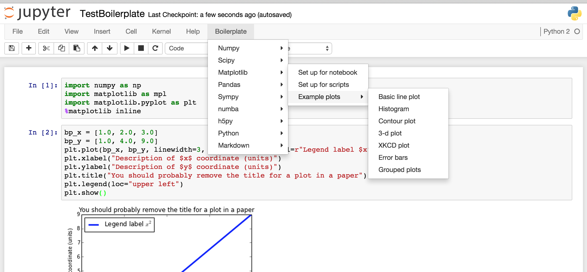

# Jupyter notebook boilerplate

Adds a menu item to Jupyter notebooks (previously IPython notebooks) to insert
boilerplate, snippets, and examples of code.

This notebook extension adds a menu item (or multiple menu items) after the
`Help` menu in Jupyter notebooks.  This new menu contains little snippets of
code that we all forget from time to time but don't want to google, or are just
too lazy to type.  It can also be helpful for people just starting out with a
programming language, who need some ideas for what to do next -- like defining
a function or a class.

The new menu comes with a default value relevant for python programming (though
this can be adjusted, as shown below).  It is called "Boilerplate", and
contains sub-menus with snippets for a few popular python packages, as well as
basic python, and some notebook markdown.  Here's a screenshot of the menu,
opened on the "Matplotlib" option:



So, for example, if you are editing a code cell and want to import matplotlib
for use in the notebook, you can just click the "Boilerplate" menu, then mouse
over "Matplotlib".  This will open up a new sub-menu, with an item "Set up for
notebook".  Clicking on that item will insert the code snippet at the point
where your cursor was just before you clicked on the menu.  In particular, for
this `matplotlib` example, the following code gets inserted:

```python
import numpy as np
import matplotlib as mpl
import matplotlib.pyplot as plt
%matplotlib inline
```

The inserted text will be selected, so that you can delete it by pressing
backspace or delete, or you can just select another snippet to replace it.

Note that many of the snippets involve variable names prefixed with `bp_`.  For
example, a new numpy array is created as `bp_new_array`.  These are
intentionally dumb names that you really should replace.  Failing to do so
could lead to ugly bugs in your code if you use multiple boilerplate snippets.

Similarly, some strings are intended to be replaced, such as the axis labels in
plots.  These are there to show you what can be done, and to remind you to put
informative labels in your plots.  If you don't want, e.g., a title on your
plot, just remove that line.


# Installation

You can download the file for this extension with the following command run in
an ipython cell (or remove `%%bash` and run from the command line):

```bash
%%bash
curl -L https://rawgithub.com/moble/jupyter_boilerplate/master/boilerplate.js > $(ipython locate)/nbextensions/boilerplate.js
echo $(ipython profile locate)/static/custom/custom.js
```

Now, that should output the name of a file.  You'll need to edit that
`custom.js` file in that directory and add the following lines:

```javascript
$([IPython.events]).on('app_initialized.NotebookApp', function(){

    require(["nbextensions/boilerplate"], function (boilerplate_extension) {
        console.log('Loading `boilerplate` notebook extension');
        var default_menus = boilerplate_extension.boilerplate_menus;
        boilerplate_extension.load_ipython_extension(default_menus);
    });

})
```

If you start a new notebook (or refresh any open ones), you should now see the
"Boilerplate" menu.


# Customizing the menu(s)

The default menu might have irrelevant stuff for you, or may not have something
you would find useful.  You can easily customize it by adjusting the `menus`
variable defined in `custom.js` (as seen above).  The `menu` is a nested
JavaScript array (which is just like a python array).  So to change the menu,
you just need to change that array.  And each menu *item* inside this array is
represented by a [JavaScript "object"](http://api.jquery.com/Types/#Object)
(which is just like a python dictionary).  So to change a menu item, you just
have to change that object.  This is best explained through examples.


## Add a custom sub-menu with simple snippets

Suppose you want to make a new menu right under "Boilerplate" with your
favorite snippets.  You create a new object for the menu item, and then just
"splice" it into the default menu.  Do this by inserting some lines into your
`custom.js`, so that it looks like this:

```javascript
        var default_menus = boilerplate_extension.boilerplate_menus;
        var my_favorites = {
            'name' : 'My favorites',
            'sub-menu' : [
                {
                    'name' : 'Menu item text',
                    'snippet' : 'new_command(3.14)',
                },
                {
                    'name' : 'Another menu item',
                    'snippet' : 'another_new_command(2.78)',
                },
            ],
        };
        default_menus[0]['sub-menu'].splice(0, 0, my_favorites);
        boilerplate_extension.load_ipython_extension(default_menus);
```

The first and last lines shown here were already placed in your `custom.js`
during installation; we've just added everything between them.

Now, if you refresh your notebook, you'll see a new menu item named "My
favorites".  Hover over it, and it will pop up a sub-menu with two more
options.  Click the first one, and it will insert `new_command(3.14)` into
your notebook wherever the cursor was.


### How it works: Creating new menu items

The new menu item `my_favorites` is an object (or dictionary) with two
attributes (or keys):

  1. `name`: Text that appears in the menu
  2. `sub-menu`: An array of more menu items

You'll also notice that the items in the `sub-menu` array are menu items with
slightly different attributes:

  1. `name`: Text that appears in the menu
  2. `snippet`: String that gets inserted when you click this menu item

You could also keep on nesting sub-menus by giving these items their own
`sub-menu` array.  This is how, for example, the "Matplotlib" -> "Example
plots" sub-sub-menu works.

So both the `sub-menu` and `snippet` attributes are optional, and could even
coexist nicely, so that you could click on a menu item, but it could still have
a sub-menu.  This is how, for example, the "pandas" -> "Select by column" menu
works.

[Alternatively, instead of `snippet`, you could add an `external_link` like the
ones in the standard "Help" menu, or an `internal_link`, which might go to
`#References` or `#Table-of-Contents` to jump to those sections.]

In all cases, the only required attribute is `name`, though you'll probably
want at least on of the other attributes, for that menu item to do something.


### How it works: Splicing new menu items into the old

Now, the `default_menus[0]['sub-menu'].splice(0, 0, my_favorites);` line uses
the [JavaScript `splice`](http://www.w3schools.com/jsref/jsref_splice.asp)
function to insert `my_favorites` into the `0` slot of
`default_menus[0]['sub-menu']`, which is the menu under "Boilerplate".

If you think about this last point, you'll realize that "Boilerplate" is just
the `0` slot of an array of menus.  If you want a new menu right in the menu
bar, you could add `my_favorites` right to that top-level array, with something
like this:

```javascript
        default_menus.splice(0, 0, my_favorites);
```

This would place your favorites before the default "Boilerplate" menu; to put
it after, you could just change the first argument to `splice`:

```javascript
        default_menus.splice(1, 0, my_favorites);
```

[In general, to add a new element at the end of an array, you could also just use the
[`push`](http://www.w3schools.com/jsref/jsref_push.asp) function.]

The second argument to `splice` just says to delete 0 other items in the
array.  If you want to replace the original item where you're splicing, change
this to 1.  To delete more items, change it to something bigger.


## More complicated snippets

The example above inserted simple one-line snippets of code.  Those snippets
didn't have any quotation marks (single or double), backslashes, or newlines,
which made everything easy.  Unfortunately, JavaScript doesn't deal well with
strings.  (There are no raw triple-quoted strings, like in python.)  So if you
want to insert code with with quotation marks, or with backslashes, or with
multiple lines, you need to be a little more careful.  Fortunately, this
extension provides a handy escaping function to help with the job.

It's best described with another example.  Let's change the first function
above, to give it some more lines and some quotes:

```javascript
        var default_menus = boilerplate_extension.boilerplate_menus;
        var escape_strings = boilerplate_extension.escape_strings;
        var my_favorites = {
            'name' : 'My favorites',
            'sub-menu' : [
                {
                    'name' : 'Menu item text',
                    'snippet' : escape_strings(['new_command(3.14)',
                                                'other_new_code("with strings!")',
                                                'string_craziness(\'escape single quotes once\')',]),
                },
                {
                    'name' : 'Another menu item',
                    'snippet' : 'another_new_command(2.78)',
                },
            ],
        };
        default_menus[0]['sub-menu'].splice(0, 0, my_favorites);
        boilerplate_extension.load_ipython_extension(default_menus);
```

As you can see, each line of code is a separate string in an array, and that
array is passed to the `escape_strings` function.  Note that the strings are in
single-quotes (`'`), which means that any single quotes you want to appear
*inside* those strings have to be escaped (`\'`), but double quotes (`"`)
don't.  (Though if you enclose your JavaScript strings in double quotes, you'll
have to reverse this advice.)  So generally, I just stick to double quotes in
my snippets.  But you can do whatever you prefer, as long as you're aware of
this problem.

Also note that if you want a literal backslash to make it into your notebook,
you'll need to use two (`\\`).  JavaScript removes one.


## Other menu manipulations

To rearrange menu items, just use standard JavaScript techniques.  The two most
likely examples are rearranging and deleting menu items.

### Rearranging menu items

For example, let's suppose you want the first two items in the "Matplotlib"
menu to be swapped.  The "Matplotlib" menu is the `2` element of the default
menu, so the first two elements are

```javascript
default_menus[0]['sub-menu'][2]['sub-menu'][0]
default_menus[0]['sub-menu'][2]['sub-menu'][1]
```

Remember that `[0]['sub-menu']` refers to the "Boilerplate" menu itself, so
`[2]['sub-menu']` refers to the "Matplotlib" menu.

Now, to do the swap, you could add lines like the following in your `custom.js`:

```javascript
        var default_menus = boilerplate_extension.boilerplate_menus;
        var tmp = default_menus[0]['sub-menu'][2]['sub-menu'][0];
        default_menus[0]['sub-menu'][2]['sub-menu'][0] = default_menus[0]['sub-menu'][2]['sub-menu'][1];
        default_menus[0]['sub-menu'][2]['sub-menu'][1] = tmp;
        boilerplate_extension.load_ipython_extension(default_menus);
```

### Deleting menu items

To delete an item, just `splice` nothing into it.  Following the example above,
suppose we want to delete the second item of the "Matplotlib" menu.  This will
do the job:

```javascript
        var default_menus = boilerplate_extension.boilerplate_menus;
        default_menus[0]['sub-menu'][2]['sub-menu'].splice(1, 1);
        boilerplate_extension.load_ipython_extension(default_menus);
```


## Debugging

Sometimes, the menu(s) might simply not appear.  This is most likely due to a
syntax error in your menu.  You can find out in Chrome by going to "View" ->
"Developer" -> "JavaScript console".  You'll see a bunch of output.  Red lines
are errors (some of which are probably *not* due to your menu error).  On the
right side of those lines, you'll see the file where the error came from, and
possibly even the line number that's causing the trouble.  Find an error that
links to either `boilerplate.js` or `custom.js`, and click on it.  Then try to
figure out what went wrong.  The most common error I've encountered is
"Unexpected string", which might indicate a missing comma, or an improperly
escaped single quote.

Or maybe the menu did appear, but it doesn't work properly.  You can also
inspect the actual elements that were inserted.  Click on "Elements" in that
Developer Tools tab that opened at the bottom of your window.  Then click the
magnifying glass, and click on the Boilerplate menu.  This will jump the Developer
Tools to the part of the source with that menu.  Scroll through to find the
menu item that's not working correctly, and take a look at it.  The text in the
`onClick` argument is especially important, since that's what gets inserted
into the notebook.


# TODO

There's a bunch of stuff I still need to do, though most of them are fairly
minor.  They're listed in the
[issue tracker](https://github.com/moble/jupyter_boilerplate/issues).

If you find a bug or have an idea for a good snippet that you think should be
added to the defaults, feel free to
[open a new issue](https://github.com/moble/jupyter_boilerplate/issues/new).

In particular, I don't use Julia or R, so I welcome suggestions for default
boilerplate for those languages.
