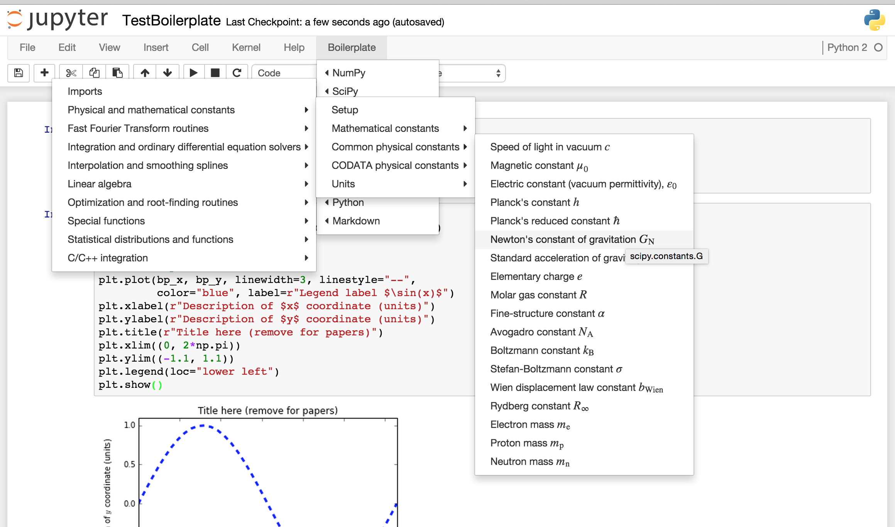
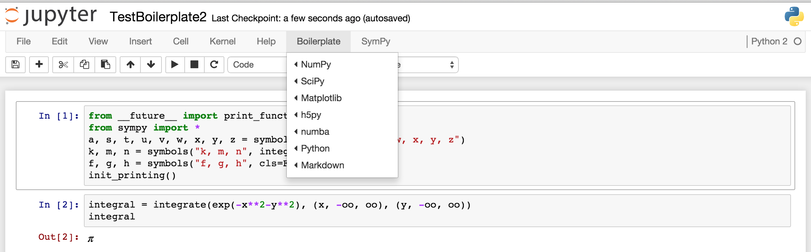
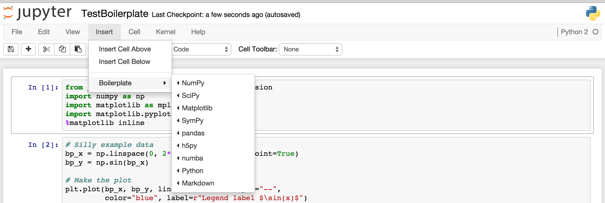

# Jupyter notebook boilerplate

Adds a menu item to Jupyter notebooks (previously IPython notebooks) to insert
boilerplate, snippets, and examples of code.

This notebook extension adds a menu item (or multiple menu items) after the
`Help` menu in Jupyter notebooks.  This new menu contains little snippets of
code that we all forget from time to time but don't want to google, or are just
too lazy to type.  It can also be helpful for people just starting out with a
programming language, who need some ideas for what to do next -- like defining
a function or a class.

  * Introducing beginners to coding.  It's useful for the beginner to have a
    list of useful possibilities (with correct syntax!) lined up right where
    the programming is happening.  It's like "Hello world" on steroids.
  * Introducing the Jupyter notebook.  It can be useful to have some nice
    things to do in the notebook to demonstrate the possibilities.  For
    example, you might suggest that someone new to the notebook run the
    Matplotlib setup and then make an example plot.
  * Convenience for lazy people like me.  For example, I usually don't want to
    bother with all the typing involved in setting up the nice (but important)
    parts of a plot, like the axis labels and legend.  But by inserting the
    template, all I have to do is change the relevant values.
  * Reminders about useful things that could be done.  For example, when I'm
    manipulating expressions in SymPy, I'll frequently forget that I can
    simplify, expand, collect, etc., in all sorts of ways.  The boilerplate
    menu reminds me of that.
  * Convenient reference for massive libraries.  For example, SciPy contains
    lots of constants.  You could certainly go to the web page describing these
    various constants to find the one you need, or you could just explore them
    right in the browser.  The same is true of SymPy's collection of special
    functions.

The new menu comes with a default value relevant for python programming, though
this is fully user-configurable, as detailed below.  The default menu is called
"Boilerplate", and contains sub-menus with snippets for a few popular python
packages, as well as basic python, and some notebook markdown.  Here's a
screenshot of the menu, opened on the "SciPy" constants menu:



(Note that some of the menus are so large that it is necessary to move the
first-level menus to the left.  This behavior is also user-configurable, as
shown [below](#change-direction-of-sub-menus).)

So, for example, if you are editing a code cell and want to import matplotlib
for use in the notebook, you can just click the "Boilerplate" menu, then mouse
over "Matplotlib".  This will open up a new sub-menu, with an item "Set up for
notebook".  Clicking on that item will insert the code snippet at the point
where your cursor was just before you clicked on the menu.  In particular, for
this `matplotlib` example, the following code gets inserted:

```python
import numpy as np
import matplotlib as mpl
import matplotlib.pyplot as plt
%matplotlib inline
```

The inserted text will be selected, so that you can delete it by pressing
backspace or delete, or you can just select another snippet to replace it.

Note that many of the snippets involve variable names prefixed with `bp_`.  For
example, a new numpy array is created as `bp_new_array`.  These are
intentionally dumb names that you really should replace.  Failing to do so
could lead to ugly bugs in your code if you use multiple boilerplate snippets.

Similarly, some strings are intended to be replaced, such as the axis labels in
plots.  These are there to show you what can be done, and to remind you to put
informative labels in your plots.  If you don't want, e.g., a title on your
plot, just remove that line.


# Installation

You can download the file for this extension with the following command run in
an ipython cell (or remove `%%bash` and run from the command line):

```bash
%%bash
curl -s -L https://rawgithub.com/moble/jupyter_boilerplate/master/boilerplate.js > $(ipython locate)/nbextensions/boilerplate.js
echo $(ipython profile locate)/static/custom/custom.js
```

That should output the name of a file.  You'll need to edit that `custom.js`
file in that directory and add the following:

```javascript
$([IPython.events]).on('app_initialized.NotebookApp', function(){

    require(["nbextensions/boilerplate"], function (boilerplate_extension) {
        console.log('Loading `boilerplate` notebook extension');
        var default_menus = boilerplate_extension.boilerplate_menus;
        boilerplate_extension.load_ipython_extension(default_menus);
        console.log('Loaded `boilerplate` notebook extension');
    });

})
```

If you start a new notebook (or refresh any open ones), you should now see the
"Boilerplate" menu, as in the screenshot above.


# Customizing the menu(s)

The default menu might have irrelevant stuff for you, or may not have something
you would find useful.  You can easily customize it by adjusting the `menus`
variable defined in `custom.js` (as seen above).  The `menu` is a nested
JavaScript array (which is just like a python list).  So to change the menu,
you just need to change that array.  And each menu *item* inside this array is
represented by a [JavaScript "object"](http://api.jquery.com/Types/#Object)
(which is just like a python dictionary).  So to change a menu item, you just
have to change that object.  This is best explained through examples.


## Add a custom sub-menu with simple snippets

Suppose you want to make a new menu right under "Boilerplate" with your
favorite snippets.  You create a new object for the menu item, and then just
"splice" it into the default menu.  Do this by inserting some lines into your
`custom.js`, so that it looks like this:

```javascript
        var default_menus = boilerplate_extension.boilerplate_menus;
        var my_favorites = {
            'name' : 'My favorites',
            'sub-menu' : [
                {
                    'name' : 'Menu item text',
                    'snippet' : ['new_command(3.14)',],
                },
                {
                    'name' : 'Another menu item',
                    'snippet' : ['another_new_command(2.78)',],
                },
            ],
        };
        default_menus[0]['sub-menu'].splice(0, 0, my_favorites);
        boilerplate_extension.load_ipython_extension(default_menus);
```

The first and last lines shown here were already placed in your `custom.js`
during installation; we've just added everything between them.

Now, if you refresh your notebook, you'll see a new menu item named "My
favorites".  Hover over it, and it will pop up a sub-menu with two more
options.  Click the first one, and it will insert `new_command(3.14)` into
your notebook wherever the cursor was.


## More complicated snippets

The example above inserted simple one-line snippets of code.  Those snippets
didn't have any quotation marks (single or double), backslashes, or newlines,
which made everything easy.  Unfortunately, JavaScript doesn't deal too well
with strings.  (There are no raw triple-quoted strings, like in python.)  So
there are just three things to remember when writing snippets.

  1. Quotation marks can be a tiny bit tricky.  There are a few options:
    1. The obvious option is to enclose your snippets in single quotation marks
       (`'`), and use only double quotation marks (`"`) within the snippet
       itself.
    2. Just as easy is to enclose your snippets in double quotation marks
       (`"`), and use only single quotation marks (`'`) within the snippet
       itself.
    3. You can also escape single quotation marks inside single quotation marks
       as `\'`.

  2. Newlines are even trickier, but the extension takes care of this for you
     as long as you put separate lines of code as separate elements of the
     `snippet` array.  Generally, there's no reason to put a literal newline in
     your snippets.

  3. JavaScript will treat backslashes as if they're trying to escape whatever
     comes after them.  So if you want one backslash in your output code,
     you'll need to put two backslashes in.

This is all best described with another example.  Let's change the first
function above, to give it some more lines and some quotes:

```javascript
        var default_menus = boilerplate_extension.boilerplate_menus;
        var my_favorites = {
            'name' : 'My favorites',
            'sub-menu' : [
                {
                    'name' : 'Menu item text',
                    'snippet' : ['new_command(3.14)',
                                 'other_new_code_on_new_line("with a string!")',
                                 'stringy(\'escape single quotes once\')',
                                 "stringy2('or use single quotes inside of double quotes')",
                                 'backslashy("This \\ appears as just one backslash in the output")',
                                 'backslashy2("Here are \\\\ two backslashes")',],
                },
                {
                    'name' : 'Another menu item',
                    'snippet' : ['another_new_command(2.78)',
                                 'with_another_new_line(1.618)',],
                },
            ],
        };
        default_menus[0]['sub-menu'].splice(0, 0, my_favorites);
        boilerplate_extension.load_ipython_extension(default_menus);
```

For more examples, look at the default menus stored in `boilerplate.js`.


### How it works: Creating new menu items

Each of the menu items above is a JavaScript object (like a python `dict`),
with some attributes -- `name` and `sub-menu` for the main menu item, and
`name` and `snippet` for the sub-menu items.  In general, any menu object can
have any of the following properties:

  1. `name`: Text that appears in the menu.  Note that this can include latex,
     as the menus are processed by MathJax after being loaded.
  2. `sub-menu`: An array of more menu items
  3. `snippet`: An array of strings turned into code when the menu item is
     clicked
  4. `internal-link`: Link to some place on the present page.  For example,
     this could be `#References`, to link to the `References` section of any
     notebook you're in.
  5. `external-link`: This just a link to some external web page, which will be
     identified with a little icon, just like in the standard notebook "Help"
     menu.  When clicked, the link will open in a new window/tab.
  6. `sub-menu-direction`: If the value of this property is `left`, place the
     sub-menu on the left of the current menu item.  This is used by default in
     the first-level sub-menus to help ensure that nested menus don't become
     too large to fit on the screen.

The `name` property is the only required one, though you'll probably want at
least one other property.  The `sub-menu` contains menu objects that again may
have any of these properties, so you can easily nest menus.  You can also
combine a `snippet` with a `sub-menu`, so that there's a default value as well
as a sub-menu.  However, the last three are mutually exclusive: `snippet` will
override any `-link`; an `internal-link` will override an `external-link`.


### How it works: Splicing new menu items into the old

Besides just creating the menu items, we may want to join together previously
created items.  That's the purpose of this line in the code above:

```javascript
default_menus[0]['sub-menu'].splice(0, 0, my_favorites);
```

This uses the
[JavaScript `splice`](http://www.w3schools.com/jsref/jsref_splice.asp) function
to insert the new menu `my_favorites` into the `0` slot of
`default_menus[0]['sub-menu']`, which is what you see under the heading
"Boilerplate".

If you think about this last point, you'll realize that "Boilerplate" is just
the `0` slot of an array of menus.  If you want a new menu right in the menu
bar, you could add `my_favorites` right to that top-level array, with something
like this:

```javascript
        default_menus.splice(0, 0, my_favorites);
```

This would place your favorites before the default "Boilerplate" menu; to put
it after, you could just change the first argument to `splice`:

```javascript
        default_menus.splice(1, 0, my_favorites);
```

[In general, to add a new element at the end of an array, you could also just use the
[`push`](http://www.w3schools.com/jsref/jsref_push.asp) function.]

The second argument to `splice` just says to delete 0 other items in the
array.  If you want to replace the original item where you're splicing, change
this to 1.  To delete more items, change it to something bigger.


## Other menu manipulations

To rearrange menu items, just use standard JavaScript techniques.  The two most
likely examples are rearranging and deleting menu items.

### Starting over with the menus

Each of the menu items under the default "Boilerplate" menu is individually
available.  So if you, want, you could just use them to build your own version
of the menu.  For example, suppose you mostly use SymPy, so you want easy
access to its menu, without having to click "Boilerplate" first.  And then
suppose you still want most of the other "Boilerplate" items, but you really
never use pandas.  You can create your own menu as follows:

```javascript
        var default_menus = boilerplate_extension.boilerplate_menus;
        default_menus[0]['sub-menu'].splice(3, 2); // Remove SymPy and pandas
        var menus = [
            default_menus[0],
            boilerplate_extension.sympy_menu,
        ];
        boilerplate_extension.load_ipython_extension(menus);
```

This gives us the original "Boilerplate" menu with SymPy and pandas removed, as
well as another menu devoted to just SymPy right in the menu bar:



You can see that the two items are indeed removed from "Boilerplate", and
"SymPy" now has a place of honor right in the menu bar.  You can, of course,
swap their order in the code above, or make any number of further alterations.

### Rearranging menu items

For example, let's suppose you want the first two items in the "Matplotlib"
menu to be swapped.  The "Matplotlib" menu is the `2` element of the default
menu, so the first two elements are

```javascript
default_menus[0]['sub-menu'][2]['sub-menu'][0]
default_menus[0]['sub-menu'][2]['sub-menu'][1]
```

Remember that `[0]['sub-menu']` refers to the "Boilerplate" menu itself, so
`[2]['sub-menu']` refers to the "Matplotlib" menu, and `[0]` and `[1]` are the
first two elements of "Matplotlib"'s sub-menus.

Now, to do the swap, you could add lines like the following in your `custom.js`:

```javascript
        var default_menus = boilerplate_extension.boilerplate_menus;
        var tmp = default_menus[0]['sub-menu'][2]['sub-menu'][0];
        default_menus[0]['sub-menu'][2]['sub-menu'][0] = default_menus[0]['sub-menu'][2]['sub-menu'][1];
        default_menus[0]['sub-menu'][2]['sub-menu'][1] = tmp;
        boilerplate_extension.load_ipython_extension(default_menus);
```

### Deleting menu items

To delete an item, just `splice` nothing into it.  Following the example above,
suppose we want to delete the second item of the "Matplotlib" menu.  This will
do the job:

```javascript
        var default_menus = boilerplate_extension.boilerplate_menus;
        default_menus[0]['sub-menu'][2]['sub-menu'].splice(1, 1);
        boilerplate_extension.load_ipython_extension(default_menus);
```

The first `1` in the argument to `splice` says to work on the element at
position 1; the second `1` says to delete 1 element of the array.


### Change direction of sub-menus

Each sub-menu may be placed to the right (default) or left of the menu
containing it.  This is controlled by the `sub-menu-direction` property of the
container.  By default, this is set to `left` for the top-level menus ---
"NumPy", "SciPy", etc.  This is important because the menus may be nested quite
deeply, and need to fit on the screen.  For example, the SciPy CODATA constants
will easily extend far past the right-hand edge of the notebook without this
feature.

But this is a configurable property.  For example, to move "SciPy" to the right
side, you could use something like this:

```javascript
        default_menus[0]['sub-menu'][2]['sub-menu-direction'] = 'right';
```

### Changing the insertion point

You might want to change the order of the menus in the navbar (that top-level
bar with "File", etc.).  For example, it might feel particularly natural to
have "Help" as the last item, so maybe you'd prefer to put the "Boilerplate"
menu *before* the "Help" menu.  Or you may prefer to maintain the structure of
the menus in the navbar, and would rather have the "Boilerplate" menu *inside*
of some other top-level menu -- like the "Insert" menu.  Personally, I prefer
to have the "Boilerplate" menu in its default position for easy access.  But
it's certainly possible to put it other places.

There are two additional arguments to the `load_ipython_extension` function
we've used above.  Their default arguments give us the usual placement of the
"Boilerplate" menu; by giving different arguments, we can change the
placement.  These arguments are

  1. `sibling`: This is an HTML node next to our new menu.  The default value
     is `$("#help_menu").parent()`, which is the "Help" menu.
  2. `insert_before_or_after`: This is just a string controlling where the new
     menu will be inserted relative to its sibling. The default value is
     `'after'`.  If you change it to `'before'`, the new menu will be inserted
     before the sibling.

So placing the "Boilerplate" menu *before* the "Help" menu is as easy as using
this call:

```javascript
        boilerplate_extension.load_ipython_extension(menus, $("#help_menu").parent(), 'before');
```

If you want to put the new "Boilerplate" menu as the last item in the "Insert"
menu, you can use this:

```javascript
$([IPython.events]).on('app_initialized.NotebookApp', function(){
    require(["nbextensions/boilerplate"], function (boilerplate_extension) {
        console.log('Loading `boilerplate` notebook extension');
        var sibling = $("#insert_cell_below");
        var menus = [
            '---',
            boilerplate_extension.boilerplate_menus[0],
        ];
        boilerplate_extension.load_ipython_extension(menus, sibling, 'after');
        console.log('Loaded `boilerplate` notebook extension');
    });
});
```

We've also inserted a horizontal dividing line with `'---'` just to separate
the new menu a little more clearly.  Here's what that looks like:



And of course, you can combine this selection of the insertion point with other
techniques above, where you change the content of the menus.


## Debugging

Sometimes, the menu(s) might simply not appear.  This is most likely due to a
syntax error in your menu.  You can find out in Chrome by going to "View" ->
"Developer" -> "JavaScript console".  You'll see a bunch of output.  Red lines
are errors (some of which are probably *not* due to your menu error).  On the
right side of those lines, you'll see the file where the error came from, and
possibly even the line number that's causing the trouble.  Find an error that
links to either `boilerplate.js` or `custom.js`, and click on it.  Then try to
figure out what went wrong.  The most common error I've encountered is
"Unexpected string", which might indicate a missing comma, or an improperly
escaped single quote.

Or maybe the menu did appear, but it doesn't work properly.  You can also
inspect the actual elements that were inserted.  Click on "Elements" in that
Developer Tools tab that opened at the bottom of your window.  Then click the
magnifying glass, and click on the Boilerplate menu.  This will jump the Developer
Tools to the part of the source with that menu.  Scroll through to find the
menu item that's not working correctly, and take a look at it.  The text in the
`onClick` argument is especially important, since that's what gets inserted
into the notebook.


# TODO

There's a bunch of stuff I still need to do, though most of them are fairly
minor.  They're listed in the
[issue tracker](https://github.com/moble/jupyter_boilerplate/issues).

If you find a bug or have an idea for a good snippet that you think should be
added to the defaults, feel free to
[open a new issue](https://github.com/moble/jupyter_boilerplate/issues/new).

In particular, I don't use Julia or R, so I welcome suggestions for default
boilerplate for those languages.
