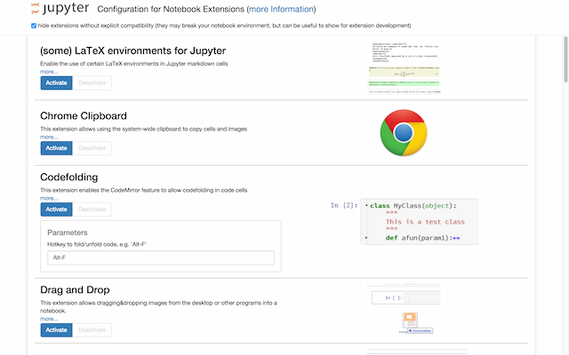

Jupyter notebook extensions
===========================

This repository contains a collection of extensions that add functionality to the Jupyter notebook.
These extensions are mostly written in Javascript and will be loaded locally in your Browser.

The IPython-contrib repository is maintained independently by a group of users and developers and not officially related
 to the IPython development team.

The maturity of the provided extensions may vary, please create an issue if you encounter any problems.

IPython/Jupyter version support
===============================

| Version     | Description            |
|-------------|------------------------|
| IPython 1.x | not supported          |
| IPython 2.x | checkout 2.x branch    |
| IPython 3.x | checkout 3.x branch    |
| Jupyter 4.x | checkout master branch |

There are different branches of the notebook extensions in this repository.
Please make sure you use the branch corresponding to your IPython/Jupyter version.

Documentation
=============

In the 4.x Jupyter repository, all extensions that are maintained and active have a markdown readme file for 
documentation and a yaml file to allow them being configured using the 'nbextensions' server extension.

For older releases (2.x and 3.x), and for general installation information, look at the [Wiki](https://github.com/ipython-contrib/IPython-notebook-extensions/wiki)

Some extensions are not documented. We encourage you to add documentation for them.

Installation
============

The simple case: You want to install the extensions as local user. Then, simply run `setup.py install` or install
the conda package. The conda package can be built by running `conda build IPython-notebook-extensions` in the parent
directory, and then doing a `conda install nbextensions`.

After installation, simply go to the `/nbextensions/` page in the notebook to activate/deactivate  your notebook extensions.

For more complex installation scenarios, please look up the documentation for installing notebook extensions, 
server extensions, pre/postprocessors, and templates at the Jupyter homepage http://www.jupyter.org

More information can also be found in the [Wiki](https://github.com/ipython-contrib/IPython-notebook-extensions/wiki)

setup.py
--------

This is the installation script that installs the notebook extensions for your local user.
It will
 1. find your local configuration directories
 2. install files from the following directories:
   * extensions - Python files like server extensions, pre- and postprocessors
   * nbextensions - notebook extensions, typically each extension has it's own directory
   * templates - jijna and html templates used by the extensions
 3. update nbconvert configuration (.py and .json) to load custom templates and pre-/postprocessors  
 4. update notebook configuration (.py and .json) to load server extensions, custom templates and pre-/postprocessors

**Important**: The installation script will overwrite files without asking. It will not delete files that do not belong
 to the repository. It will also not delete your Jupyter configuration.

Notebook extension structure
============================

Each notebook extension typically has it's own directory containing:
 * thisextension/main.js - javascript implementing the extension
 * thisextension/main.css - optional CSS
 * thisextension/readme.md- readme file describing the extension in markdown format
 * thisextension/config.yaml - file describing the extension to the nbconfig server extension

