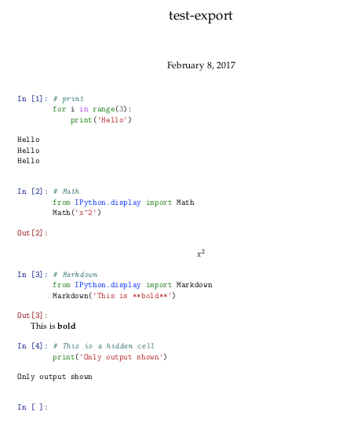
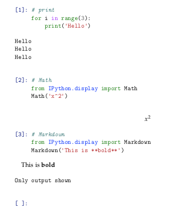

.. module:: jupyter_contrib_nbextensions.nbconvert_support

Exporting
=========

Some extensions add functionality you might want to keep when exporting a notebook
to another format using :mod:`nbconvert`.

There are several parts to customize :mod:`nbconvert` output:
 * *Preprocessors* to change content before conversion to another format
 * *Postprocessors* to change content after conversion to another format
 * *Exporters* to actually do the conversion to another format
 * *Templates* provide customization using Jinja without writing an exporter

Preprocessors
-------------

Generic documentation for preprocessors can be found at
`nbconvert.readthedocs.io/en/latest/api/preprocessors.html <http://nbconvert.readthedocs.io/en/latest/api/preprocessors.html>`__.

Retaining Codefolding
^^^^^^^^^^^^^^^^^^^^^

.. autoclass:: CodeFoldingPreprocessor

Retaining Highlighting
^^^^^^^^^^^^^^^^^^^^^^

.. autoclass:: HighlighterPreprocessor

Evaluating code in Markdown (PyMarkDown)
^^^^^^^^^^^^^^^^^^^^^^^^^^^^^^^^^^^^^^^^

.. autoclass:: PyMarkdownPreprocessor

Converting linked SVG to PDF
^^^^^^^^^^^^^^^^^^^^^^^^^^^^

.. autoclass:: SVG2PDFPreprocessor

Postprocessors
--------------

Generic documentation for postprocessors can be found at
`nbconvert.readthedocs.io/en/latest/api/postprocessors.html <http://nbconvert.readthedocs.io/en/latest/api/postprocessors.html>`__

Retaining Highlighting
^^^^^^^^^^^^^^^^^^^^^^

.. autoclass:: HighlighterPostProcessor

Exporters
---------

Generic documentation for exporters can be found at

`nbconvert.readthedocs.io/en/latest/api/exporters.html <http://nbconvert.readthedocs.io/en/latest/api/exporters.html>`__

Embed images in HTML
^^^^^^^^^^^^^^^^^^^^

.. autoclass:: EmbedHTMLExporter

    Allows embedding images (pdf, svg and raster images) into a HTML file as base64 encoded binary,
    instead of linking to them.

        jupyter nbconvert --to html_embed --NbConvertApp.codefolding=True mynotebook.ipynb

Export Table of Contents
^^^^^^^^^^^^^^^^^^^^^^^^

.. autoclass:: TocExporter

Inlining css & javascript
^^^^^^^^^^^^^^^^^^^^^^^^^

.. autoclass:: ExporterInliner

    Forms the basis for :class:`ExporterCollapsibleHeadings`.

Collapsible Headings
^^^^^^^^^^^^^^^^^^^^

.. autoclass:: ExporterCollapsibleHeadings

Templates
---------

Generic documentation on templates can be found at
`nbconvert.readthedocs.io/en/latest/customizing.html <http://nbconvert.readthedocs.io/en/latest/customizing.html>`__

The main `jupyter contrib nbextension install` command will attempt to alter
the nbconvert config to include the package's templates directory, as mentioned
in :ref:`jupyter-contrib-nbextensions-config-edits`.
This should allow you to use the templates `nbextensions.tpl` and
`nbextensions.tplx` mentioned below just by specifying `--template=nbextensions`
in your call to nbconvert.

To find the location of the custom templates you can use this function:
.. autofunction:: templates_directory

nbextensions.tpl
^^^^^^^^^^^^^^^^

This is a template for notebook extensions that allows hiding code cells, output, or text cells.
Usage::

    $ jupyter nbconvert --template=nbextensions mynotebook.ipynb

The supported cell metadata tags are:
 * `cell.metadata.hidden` - hide complete cell
 * `cell.metadata.hide_input` - hide code cell input
 * `cell.metadata.hide_output` - hide code cell output

Detailed description:

This will hide the input of either an individual code cell or all code cells of the notebook:
.. code-block::

    
    
    
    {{ super() }}
    
    

This will hide the output of an individual code cell:
.. code-block::

    
    
    
        {{ super() }}
    
    

This will suppress the prompt string if the input of a code cell is hidden:
.. code-block::

    
    
        
 

    
        {{ super() }}
    
    

nbextensions.tplx
^^^^^^^^^^^^^^^^^

This template implements the features to hide cells used by extensions like hide_input, etc.
It won't produce a valid LaTeX file alone, use it to extend your own template (see printviewlatex.tplx).

printviewlatex.tplx
^^^^^^^^^^^^^^^^^^^

This template can be used to customize nbconvert when creating LaTex or PDF documents.
It extends the `nbextensions.tplx` template:
.. code-block::

    ((= Nbconvert custom style for LaTeX export =))
    ((*- extends 'nbextensions.tplx' -*))

The first block is to
.. code-block::

    %===============================================================================
    % Custom definitions
    %===============================================================================
    ((* block definitions *))
        ((( super() )))

        % Pygments definitions
        ((( resources.latex.pygments_definitions )))

        % Exact colors from NB
        \definecolor{incolor}{rgb}{0.0, 0.0, 0.5}
        \definecolor{outcolor}{rgb}{0.545, 0.0, 0.0}

        % Don't number sections
        \renewcommand{\thesection}{\hspace*{-0.5em}}
        \renewcommand{\thesubsection}{\hspace*{-0.5em}}

    ((* endblock definitions *))

    % No title
    ((* block maketitle *))((* endblock maketitle *))

The next block contains
.. code-block::

    %===============================================================================
    % Latex Article
    %===============================================================================
    % You can customize your LaTeX document here, e.g. you can
    % - use a different documentclass like
    %   \documentclass{report}
    % - add/remove packages (like ngerman)

    ((* block docclass *))
    % !TeX spellcheck = de_DE
    % !TeX encoding = UTF-8
    \documentclass{scrreprt}
    \usepackage{ngerman}
    ((* endblock docclass *))

Usage::

    $ jupyter nbconvert --to=latex --template=printviewlatex mynotebook.ipynb

The result without specifying a custom template looks like this:

If you specify the `printviewlatex` template, it should look like this:

If you want to customize the template, simply copy `printviewlatex.tplx` and modify it.

