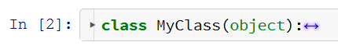

This extension adds codefolding functionality from CodeMirror to a codecell.

After clicking on the gutter (left margin of codecell) or typing `Alt+F`, the code gets folded. See the examples below. The folding status is saved in the cell metadata of the notebook, so reloading of a notebook will restore the folding view.


Supported modes
===============

Three different folding modes are supported:


Indent Folding
--------------

Python-style code folding, detetects indented code.


The unfolded code above can be folded like this:


or this:




Bracket Folding
---------------

Other languages like Javascript use brackets to designate code blocks. Codefolding is supported for Javascript in using the `%%javascript` magic in a codecell.


Firstline Comment Folding
-------------------------

Allows collapsing of Python code cells to a single comment line. This is useful for long codecells. The algorithm simply looks for a comment in the first line and allows folding in the rest of the cell.


The code above can be folded like this:


Installation
============

Install the master version of the IPython-notebook-extensions repository as explained in the [wiki](https://github.com/ipython-contrib/IPython-notebook-extensions/wiki/).

Then load the extension from within the IPython notebook:

```jupyter
%%javascript
IPython.load_extensions('usability/codefolding/codefolding');
```


Internals
=========

You need the current master branch from Codemirror in order to get codefolding to work. This is still very much work-in-progress.

The folding information is saved in the metadata of each codecell. The number of the folding start line (beginning with 0) is stored in an array: 

```javascript
cell.metadata.code_folding = [ 3, 20, 33 ]
```

When reloading the IPython notebook, the folding status is restored.


