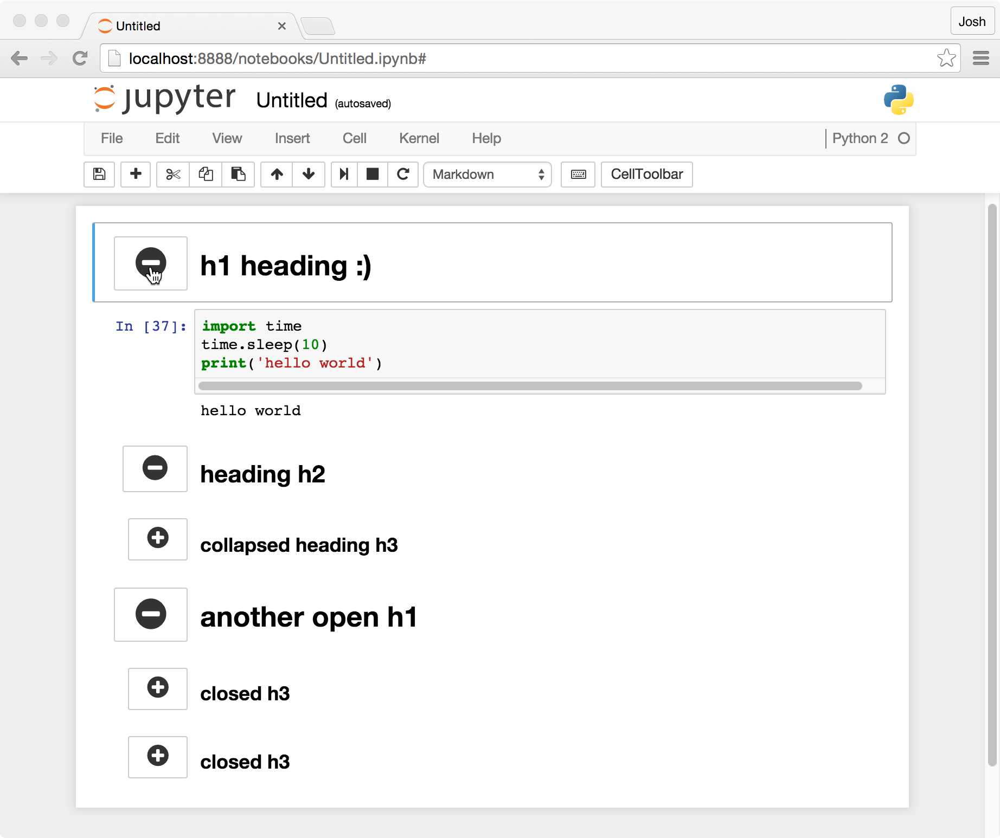

Allows notebook to have collapsible sections, separated by headings.

Any markdown heading cell (that is, one which begins with 1-6 `#` characters),
becomes collapsible once rendered.

The collapsed/expanded status of the headings is stored in the cell metadata,
and reloaded on notebook load.


Options
=======

The extension offers a few options for how to expand and collapse headings,
each of which can be enabled or disabled from the nbextensions config page:

* Command-mode keyboard shortcuts, (enabled by default, and set to left and
  right arrow keys, but bindings are also configurable from the config page).
* A toggle button in the input prompt area of each heading cell (as seen in the
  screenshot below, enabled by default)
* A toolbar button to collapse the nearest heading to the curently selected
  cell (disabled by default)




Internals
=========

Heading cells which are collapsed have a value set in the cell metadata, so
that

```javascript
cell.metadata.heading_collapsed = true
```

The extension patches some Jupyter methods:
* `TextCell.prototype.execute` is patched to add/remove the toggle buttons,
  as well as update the visibility of any cells below the new one.
* `Notebook.prototype.select` is patched to make sure any collapsed headings
  which would be hiding the new selection get uncollapsed (expanded).
* `Notebook.prototype.undelete` and `Notebook.prototype.delete_cells` are
  patched to trigger an update of which cells should be visible or hidden.

The extension also patches two existing Jupyter actions: those triggered in
command mode by the up/down arrow keys. Ordinarily, these select the cell
above/below the current selection. Once patched by `collapsible_headings`, they
have the same behaviour, but skip over any cells which have been hidden (by a
collapsed heading, or, in fact, by any other mechanism).

Finally, `collapsible_headings` registers two new actions, namely
`collapsible_headings:collapse_heading` and
`collapsible_headings:uncollapse_heading`, which are used by the keyboard
shortcuts (if used), and can be called as with any other action.

This could be used in an nbconvert preprocessor, as in the older
hierarchical_collapse extension but I
([@jcb91](https://github.com/jcb91)) haven't written one.
If you'd like one, feel free to get in touch to ask for it!
