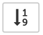
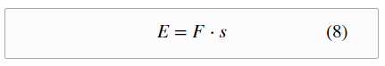

Description
===========

Enable automatic equation numbering and reset numbering upon pressing toolbar button .


A LaTeX equation like:   
```TeX
\begin{equation}
E = F \cdot s 
\end{equation}
```

generates the numbered equation:   


Internals
=========

Equation numbering is activated this way:
```Javascript
MathJax.Hub.Config({
    TeX: { equationNumbers: { autoNumber: "AMS" } }
});
```

Equation numbers are reset and math equations rerendered using this code: 
```Javascript
MathJax.Extension['TeX/AMSmath'].startNumber = 0;
MathJax.Hub.Queue(["Reprocess",MathJax.Hub]);
```
