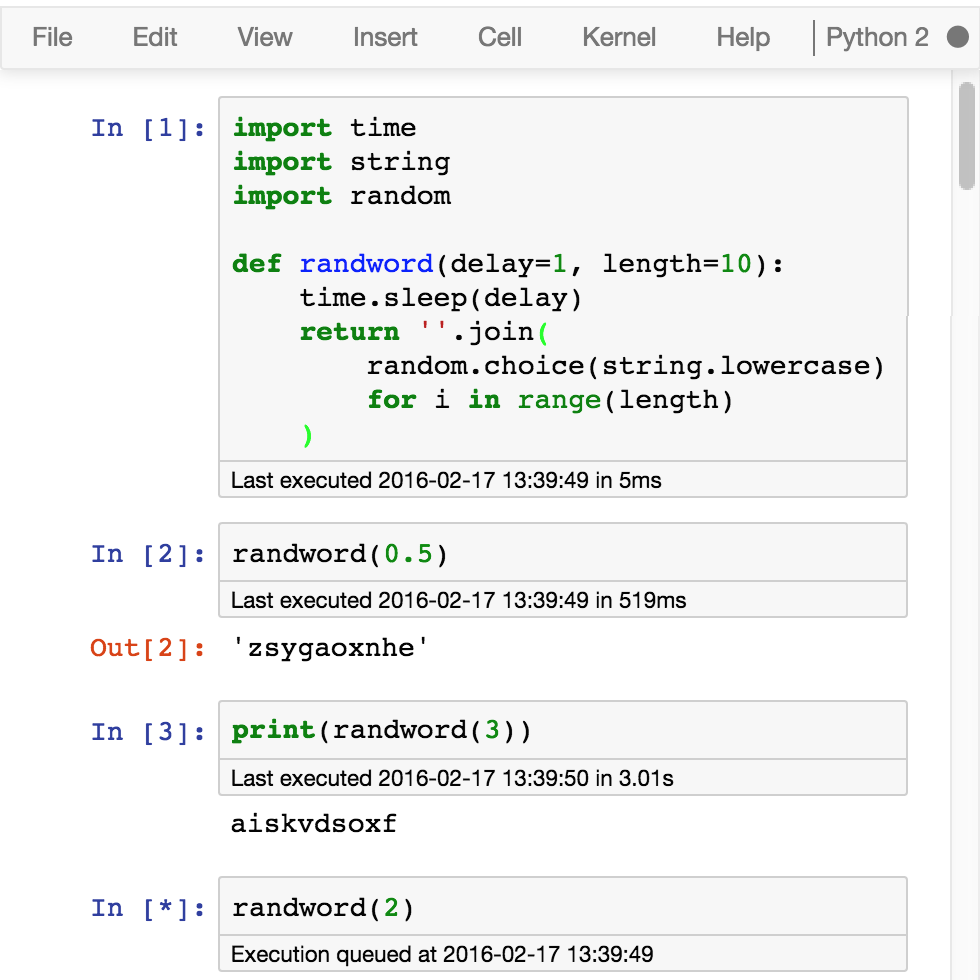

This extension displays when the last execution of a cell occurred and how long it took. 


Display
=======

Every executed cell is extended with a new area, attached at the bottom of the input area, that displays when the user started the last execution of this cell. When the kernel finishes to execute a cell, this area is update with the duration. 




Toggling
========

The timings area can be hide by double clicking on it or using the option in the cell menu. The menu toggle timings->All hides (resp. shows) all the possible timings area if the first cell is displayed (resp. hidden).


Internals
=========

To be sure that the kernel is run intentionally by executing a codecell, codecell.prototype.execute() is overloaded and a new event 'ExecuteCell.ExecuteTime' is fired, that this extension catches to display the start time. We use the event 'status_idle.Kernel' to know when the kernel finished the execution of the cell. 


Installation
============

Copy the contents of the `execute_time` directory to a new `/nbextensions/usability/execute_time` directory of your user's IPython directory, or from IPython simply call

```python
import IPython
IPython.html.nbextensions.install_nbextension('https://raw.github.com/ipython-contrib/IPython-notebook-extensions/master/nbextensions/usability/execute_time/ExecuteTime.js')
```

Then you can manually load the extension for a single notebook from within the IPython notebook:

```javascript
%%javascript
IPython.load_extensions('usability/execute_time/ExecuteTime');
```

For permanent installation instructions using the nbextensions config tool, please see the
[readme](../../config/readme.md),
or the [wiki](https://github.com/ipython-contrib/IPython-notebook-extensions/wiki)


TODO
====

The timings information could be stored into the notebook and displayed when it is loaded. Where these information should be stored is still to be decided (maybe in the metadata).
