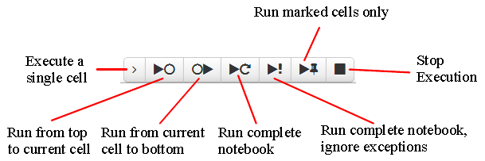
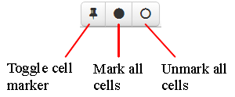
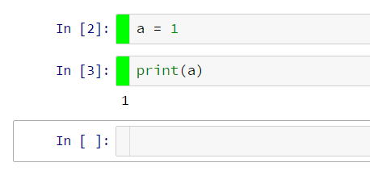

Runtools provide a number of additional functions for working with code cells in the IPython notebook:


Code Cell Execution
-------------------

* Execute a single cell
* Execute from top cell to currently selected cell
* Execute from currently selected cell to bottom cell
* Execute all cells
* Execute all cells, ignore exceptions (requires https://github.com/ipython/ipython/pull/6521)
* Execute marked code cells (cells with green gutter area are marked)
* Stop execution (duplicate to standard toolbar button)


Code Cell Marking
-----------------

* Mark one or more code cell


Code Cell Display
-----------------

* Hide or show input (i.e. the source code) of marked code cells
* Hide or show output of marked code cells


Description
===========

The *runtools* extension adds a button to turn on/off a floating toolbar:


This adds Code execution buttons:


Codecells can be marked by clicking on the gutter of a codecell or by clicking on the markers toolbar:


A IPython notebook with marked cells looks like this:



Installation
============

Copy the contents of the `runtools` directory to a new `/nbextensions/usability/runtools` directory of your user's IPython directory.
Then you can manually load the extension from within the IPython notebook:

```javascript
%%javascript
IPython.load_extensions('usability/runtools/main');
```

Or, for permanent installation instructions, please see the [readme](../../README.md),
or the [wiki](https://github.com/ipython-contrib/IPython-notebook-extensions/wiki).


Internals
=========

New metadata elements added to each cell:
* `cell.metadata.hide_input` - hide input field of the cell
* `cell.metadata.hide_output` - hide output field of the cell
* `cell.metadata.run_control.marked` - mark a codecell
