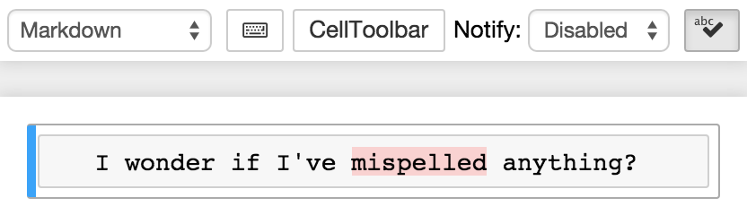

This extension provides a CodeMirror overlay mode to highlight incorrectly
spelled words in Markdown and Raw cells:

It was inspired in part by
[NextStepWebs/codemirror-spell-checker](https://github.com/NextStepWebs/codemirror-spell-checker/blob/78773ebdd6c8cf8acd043342023636ae345ca0f3/src/js/spell-checker.js)
at the
[suggestion](https://github.com/ipython-contrib/IPython-notebook-extensions/issues/521)
of [@JanSchulz](https://github.com/JanSchulz).

Spellchecking
-------------
The actual spellchecking is performed by the
[Typo.js](https://github.com/cfinke/Typo.js) library, which is included as a
dependency, with its own license.
Typo.js allows the use of
[hunspell](https://en.wikipedia.org/wiki/Hunspell)-style dictionaries in a
javascript-based spellchecker.

Dictionaries
------------

The dictionaries used by the extension are fetched according to the parameters.
The urls can be relative (for files on your jupyter server) or absolute (for
files hosted elsewhere, e.g. on a cdn like the defaults).
I ([@jcb91](https://github.com/jcb91)) think that typo.js _can_ also load
dictionaries from a chrome extension, which could presumably give dramatically
faster load times.
If you know about this and would like it to work, drop me a line on github, and
I'll be happy to help.

Internals
---------
Any mispelled word has the css class `cm-spell-error` applied to it, so you can
customize their styling in cutom.css if you'd like.
