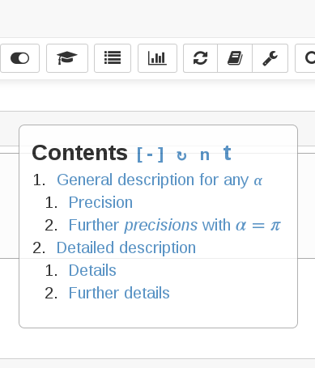
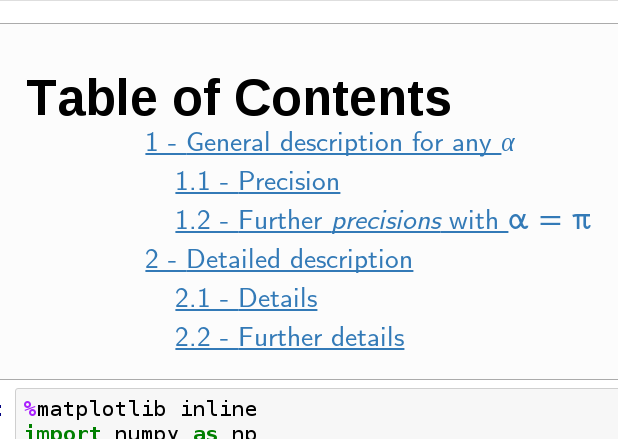

# Table of Contents (2)

## Description and main features

This extension adds a small button in the main toolbar, which enables to collect all running headers in the notebook and display them in a floating window. 

The table of contents is automatically updated when modifications occur in the notebook. The toc window can be moved and resized, the table of contents can be collapsed or the window can be completely hidden. The position, dimensions, and states (that is 'collapsed' and 'hidden' states) are remembered (actually stored in the notebook's metadata) and restored on the next session. The floating window also provides two links in its header for further functionalities:

- the "n" link toggles automatic numerotation of all header lines
- the "t" link toggles a toc cell in the notebook, which contains the actual table of contents, possibly with the numerotation of the different sections. 

The state of these two toggles is memorized and restored on reload. 

 

## Configuration
The initial configuration can be given using the IPython-contrib nbextensions facility. The maximum depth of headers to display on toc can be precised there (with a default of 4), as well as the state of the toc cell (default: false, ie not present) and the numbering of headers (true by default). The differents states and position of the floating window have reasonable defaults and can be modfied per notebook). 

# Testing 
- At loading of the notebook, configuration and initial rendering of the table of contents were fired on the event "notebook_loaded.Notebook". Curiously, it happened that this event was either not always fired or detected. Thus I rely here on a combination of  "notebook_loaded.Notebook" and "kernel_ready.Kernel" instead. 

- This extension also includes a quick workaround as described in https://github.com/ipython-contrib/IPython-notebook-extensions/issues/429

## History

- This extension was adapted by minrk https://github.com/minrk/ipython_extensions
from https://gist.github.com/magican/5574556
- Added to the ipython-contrib/IPython-notebook-extensions repo by @JanSchulz
- @junasch, automatic update on markdown rendering, 
- @JanSchulz, enable maths in headers links
- @jfbercher december 06, 2015 -- Big update: automatic numbering, toc cell, window dragging, configuration parameters
- @jfbercher december 24, 2015 -- nested numbering in toc-window, following the fix by [@paulovn](https://github.com/minrk/ipython_extensions/pull/53) in @minrk's repo. December 30-31, updated config in toc2.yaml to enable choosing the initial visible state of toc_window via a checkbox ; and now resizable. 
- @slonik-az february 13, 2016. rewritten toc numberings (more robust version), fixed problems with skipped heading levels, some code cleanup
- @jfbercher february 21, 2016. Fixed some issues when resizing the toc window. Now avoid overflows, clip the text and add a scrollbar. 
- @jfbercher february 22, 2016. Add current toc number to headings anchors. This enable to get unique anchors for recurring headings with the same text. An anchor with the original ID is still created and can be used (but toc uses the new ones!). It is also possible to directly add an html anchor within the heading text. This is taken into account when building toc links (see comments in code). 
