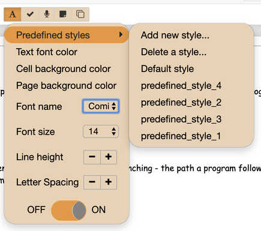
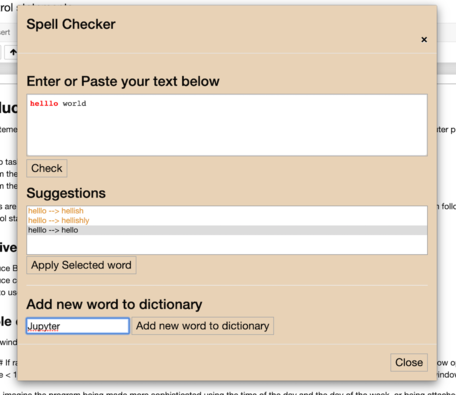
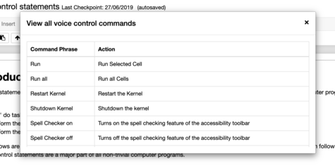
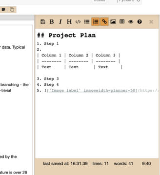
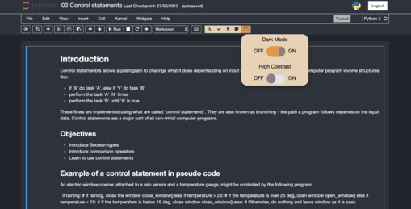
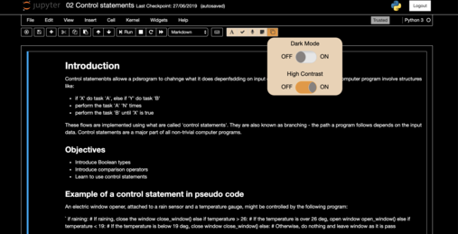

# Accessibility Toolbar

This extension adds a toolbar to your notebook with five separate accessibility tools. For a summary of the features
see: [Accessibility Toolbar](https://www.youtube.com/watch?v=8Nv3uosr8s4&t=7s)
The makeup of these tools is as follows:

## Notebook Style Manager

- The aim of this extension is to provide the user with the tools to customise their notebook according to their own
  specifications.
- This feature includes support for text size and font changes, line and letter spacing changes and
  various changes to the pages colours.
- There is also a predefined styles feature allowing for the saving and loading
  of saved page styles.
- Feature summary can be found at: [Notebook Style Manager](https://youtu.be/8Butk1EhpSw)

### Notes

- All of the styles are saved when refreshing the page into localStorage.
- To create a predefined style choose your required styles, click on "Add new style", select a name and then
  click save to save your style.
- Beware when selecting "Default style" option as this will wipe any style changes not saved as a predefined
  style.

---

## Spell Checker

- The aim of this extension is to provide spell checker functionality for all markdown cells in a notebook.
- This feature includes the ability to be notify the user of spelling errors inline.
- It also provides a spell checker menu where words can be pasted and suggestions can be generated for the correct
  spelling of miss-spelt words.
- New words can be added to the dictionary there.
- It is also possible to switch between bold or underlining notifications of spelling mistakes.
- Feature summary can be found at: [Spell Checker](https://youtu.be/WfMLjviZlMc)

### Notes

- The Spell Checker icon will turn green when it is enabled.
- The Spell Checker only works on markdown and **NOT** on code.
  

---

## Voice Control

- The aim of this extension is to provide voice control support for some of the common actions on a Jupyter notebook.
- Once enabled the toolbar will listen for any of these key actions and will then execute them.
- The possible commands are as follows:
  - Run: Run Selected Cell
  - Run all: Run all Cells
  - Restart Kernel: Restart the Kernel
  - Shutdown Kernel: Shutdown the kernel
  - Spell Checker on: Turns on the spell checking feature of the accessibility toolbar
  - Spell Checker off: Turns off the spell checking feature of the accessibility toolbar
  - View Commands: Show the table of available commands
  - Stop Voice control: Turns off the voice control feature of the accessibility toolbar
  - Show Planner: Opens the planner provided by the accessibility toolbar
  - Hide Planner: Minimises the planner provided by the accessibility toolbar
  - Dark Mode: Activates the dark theme provided by the accessibility toolbar
  - High Contrast Mode: Activates the high contrast theme provided by the accessibility toolbar
  - Default Mode: Reverts the notebook to the default theme
- Feature summary can be found at: [Voice Control](https://youtu.be/UepPF3ECV_s)

###Notes

- The Voice Control feature is only supported on Chrome at the moment.
- The Voice Control button will turn green when it is listening for a command.
  

---

## Planner

- The aim of the Planner is to provide a way for a user to plan out their notebook before and during its creation.
- The Planner is a Mardown text editor that is displayed at the side of the page and is saved together with the
  notebook.
- The Planner includes all of the standard Markdown features, with shortcuts to some of them as buttons at the top.
- Feature summary can be found at: [Planner](https://youtu.be/smV4PZKINiM)

###Notes

- The planner automatically saves every minute and can be manually saved using the "Save" button
- There are various size options for images added to the planner:
  - 20% width: imagewidth=planner-20
  - 30% width: imagewidth=planner-30
  - 40% width: imagewidth=planner-40
  - 50% width: imagewidth=planner-50
  - 60% width: imagewidth=planner-60
  - 70% width: imagewidth=planner-70
  - 80% width: imagewidth=planner-80
  - 90% width: imagewidth=planner-90
  - 100% width: imagewidth=planner-100

## Accessible Themes

- The aim of the accessible themes is to provide a high contract and dark theme mode for users depending on their
  preferences.
- The themes can be easily toggled from the menu provided.
- Feature summary can be found at: [Themes](https://youtu.be/EbC200P6KwM)

  
  
