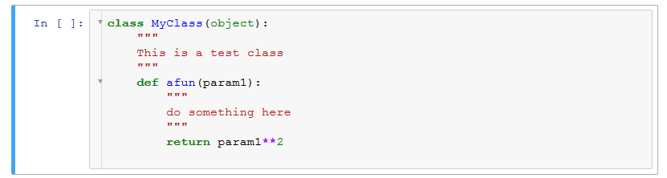
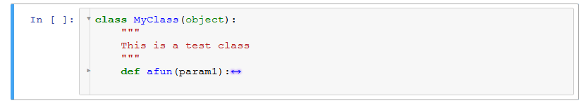
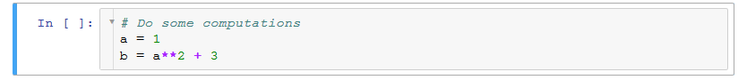
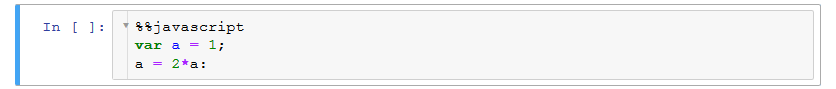

Codefolding
===========

This extension adds codefolding functionality from CodeMirror to a codecell.

In edit mode, clicking on the triangle in the gutter (left margin of codecell) or typing the codefolding hotkey 
(default is `Alt+F`), folds the code. 
In command mode, the folding hotkey relates to the first line of the codecell. 

See the examples below. The folding status is saved in the cell metadata of the notebook, so reloading of a notebook will restore the folding view.

Supported modes
---------------

Three different folding modes are supported:


### Indent Folding

In the image below, the Codefolding extension detects unfolded, Python-style indentations:



The unfolded code above can be folded like this:



or this:


### Bracket Folding

Other languages like Javascript use brackets to designate code blocks. Codefolding is supported for Javascript in using the `%%javascript` magic in a codecell.


### Firstline Comment Folding

Allows collapsing of Python code cells to a single comment line. This is useful for long codecells. The algorithm simply looks for a comment in the first line and allows folding in the rest of the cell.



The code above can be folded like this:


### Magics Folding

If you specify a magic in the first line of a cell, it can be folded, too.



Folded:


Installation
------------

Note that there are two extensions: one for the notebook interface (`notebook:codefolding/main`),
and one for the editor (`edit:codefolding/edit`) which have slightly different installation syntax:

```bash
jupyter nbextension enable codefolding/main
jupyter nbextension enable --section edit codefolding/edit
```


Internals
---------

When saving a notebook, the folding information is saved in the metadata of
each codecell.
The number of the folding start line (beginning with 0) is stored in an array:

```javascript
cell.metadata.code_folding = [ 3, 20, 33 ]
```

When reloading the notebook, the folding status is restored.

The codefolding hotkey can be customized using the notebook extensions configurator.
The settings are stored as `"codefolding_hotkey": "alt-f"` in `the notebook.json` configuration file.


Exporting
---------

To export a notebook containing folded cells, you will need to apply a custom
preprocessor for nbconvert.
The preprocessor is located in
`jupyter_contrib_nbextensions.nbconvert_support.pre_codefolding`.

The preprocessor is installed when you install the
`jupyter_contrib_nbextensions` package.
To activate the preprocessor manually,
add the following lines to `jupyter_nbconvert_config.py`:

```python
Exporter.preprocessors += ['jupyter_contrib_nbextensions.nbconvert_support.CodeFoldingPreprocessor']
```
