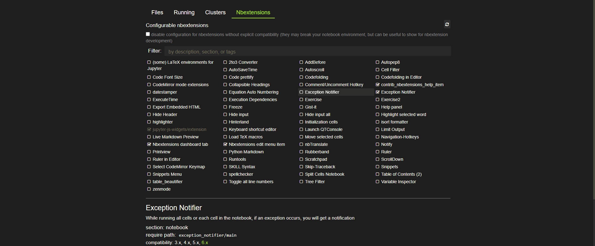

# Exception Notifier

While working on our code in Jupyter Notebook we tend to forget after a while that we working, actually running some code, but there was an exception that interrupted the long running task. :angry::cry: 

COMEON!!!!!! NOT FARE

We again run it and have to wait and watch for another iteration to check if the fix worked or did it not.

Such a pain. :worried:

Why don't we think about a exception notifier. Wait, What?! Don't we already have a notifier? Ahh yes we do, but not an exception notifier.

Well we can use them in each the cells and all that, but that's a mess in the notebook.

We can have an extension, in the notebook where if there was an exception we will be notified like a normal notifier does.

## Installation:

```
pip install jupyter
```

```
pip install jupyter_contrib_nbextensions && jupyter contrib nbextensions install
```

Start up a Jupyter Notebook and navigate to the new Nbextensions tab:



Enable the extension 'Exception Notifier' enjoy the productivity benefits.
(If you don’t see a tab, open a notebook and click Edit > nbextensions config)