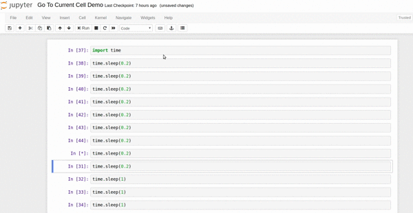
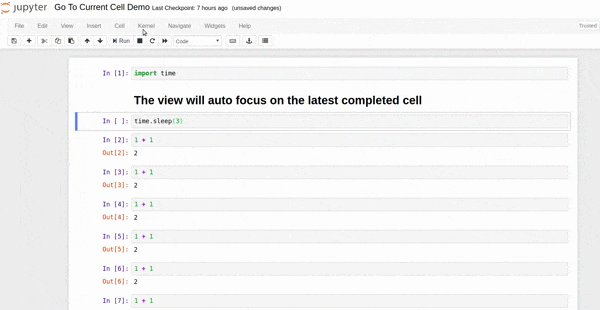

Go to Running Cell
==================

This is an extension allows you to jump to the current running cell. You can also activate this functionality automatically, i.e., your view is always scolling to the current cell.

Button: A button with eye icon that you can go to the first running cell.  

Keyboard shortcuts:  
-------------------
__*Alt-I*__ (Jump to first running cell)  
__*Meta-[*__ (Follow executing cell On)  
__*Meta-]*__(Follow executing cell Off)  

Demo
----
### Jump to first running cell

### Follow executing cell

