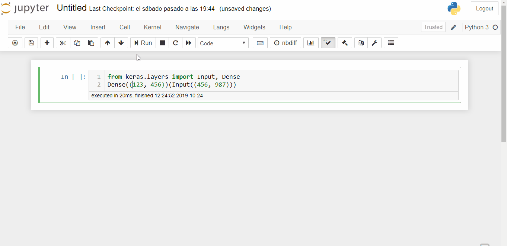

# Goto Error notebook extension

Clicking on filenames in the stack trace opens up the relevant source file.

## Install

Clone the repo:

```bash
git clone git://github.com/teticio/nbextension-gotoerror
```

Install the extension:

```bash
jupyter nbextension install nbextension-gotoerror --user
```

Enable the extension:

```bash
jupyter nbextension enable nbextension-gotoerror/main
```

As the Jupyter server is only able to access files in the directory in which it is run or a subdirectory, for the notebook to be able to open the source files it is necessary to provide a soft link to the source file directory. For example, if you don't use virtual environments, make soft link in the Jupyter launch directory to the site-packages directory of your Python instalation (e.g. ```~/lib/python3.6/site-packages```) and call this ```site-packages```. Then set the prefix parameter in the nbextension configuration to ```~/lib/python3.6```. 

If you do use virtual environments, then point the soft link to the ```envs``` directory and set the prefix parameter accordingly.

To make a soft link in Linux:

```bash
ln -s ~/.local/lib/python3.6/site-packages site-packages
```

To make a soft link in Windows:

```bash
mklink -d envs C:\users\teticio\Anaconda\python\envs
```


