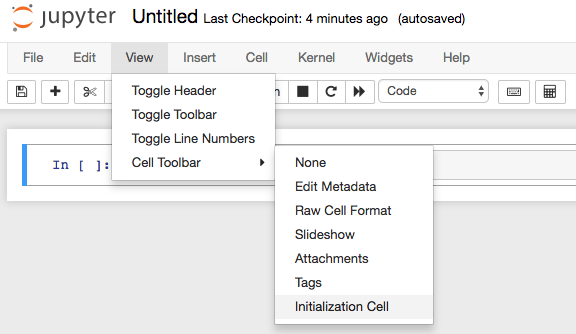

init_cell
=========

Add a cell toolbar selector to mark cells as 'initialization' cells .
Such initialization cells are run:

 * on clicking the provided button in the main toolbar
   
 * by default, on kernel ready notification for trusted notebooks.
   This is configurable (see options section).
   In untrusted notebooks, a warning is displayed if the cells would otherwise
   have been run.

Options
-------

This nbextension provides option configurable using the
[jupyter_nbextensions_configurator](https://github.com/Jupyter-contrib/jupyter_nbextensions_configurator).

Once the extension is enabled, turn on the cell toolbar within your Notebook using 
the "View > Cell Toolbar > Initialization Cell" menu

The running of initialization cells on kernel ready notification can be
frustrating if your kernel is attached to multiple frontends, or is persistent
between frontend reloads (e.g. reloading the notebook browser page without
killing the kernel).
As such, the option `init_cell.run_on_kernel_ready` in the notebook config
section controls whether this behaviour occurs.
The server's config value can also be overridden on a per-notebook basis by
setting `notebook.metadata.init_cell.run_on_kernel_ready`.

Internals
---------

Cells are marked as initialization cells in their metadata, as

  cell.metadata.init_cell = true

The running of initialization cells on kernel ready is bound to the Jupyter
event `kernel_ready.Kernel`.
