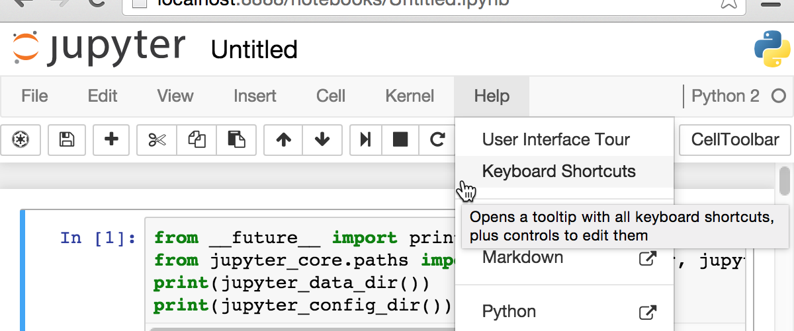
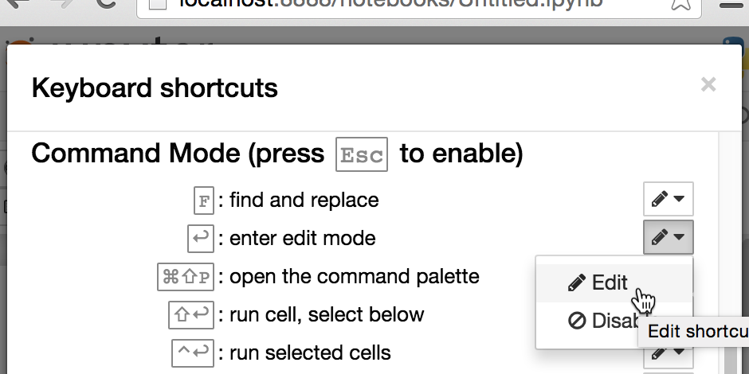

Keyboard shortcut editor
========================

This extension allows you to edit or remove the default notebook keyboard
shortcuts, or create your own new ones.

Currently, this extension supports the editing of any shortcut provided by
Jupyter, with the exception of those provided by the CodeMirror editors, since
they use a different API.

To edit your keyboard shortcuts, open the keyboard shortcuts help dialog,
either by pressing <kbd>h</kbd> in command mode, or by selecting
`help > keyboard shortcuts` from the menu:



When the extension has been loaded, each shortcut in the dialog will show a
small dropdown menu next to it, with items to remove or edit the shortcut:



Clicking the edit item opens a second modal dialog, with a text input. While
the input has focus, you can press keys to form your combination. The reset
button (the curly arrow to the left hand side) allows you to clear any keys you
may input accidentally.


If you'd like to disable an existing shortcut, you can click the 'Disable'
button on the dropdown. This will move the shortcut into a new section on the
dialog headed 'disabled'. You can click the reset button next to disabled
shortcuts to re-enable them:


You can create new custom keyboard shortcuts using the link at the base of the
shortcut list for each mode:


This opens a dialog similar to the editor, with the addition of a select box
from which you can select the action which will be called:


Limitations: problem shortcuts
------------------------------

Since this editor uses the same key-identification method as the notebook,
anything you can get it to recognise should (?!) work as a notebook shortcut,
even if it gets represented by the editor differently to the letters on your
actual, physical, keyboard. However, bear in mind that key identification is
not perfect, (this is a problem on the web in general), so it's possible that
some combinations may not be identified by Jupyter at all. In such cases, the
editor should notify you:


In addition, the handling of shortcuts including commas is currently
compromised to the extent that they don't really work properly, so the editor
also won't accept anything with a comma in it:


The dialog will also not accept a shortcut that would conflict with one which
already exists:


If the conflicting shortcut is provided by Jupyter rather than CodeMirror, you
can of course disable it to prevent the conflict occurring.


Internals
---------

The extension stores a record of the edits in use in the config, as a list
of objects for each mode. Those without a `to` key denote shortcuts to disable,
while those without a `from` key denote new shortcuts. For example:

```json
// the config object with section name 'notebook' at the base URL
{
  ...
  "kse_rebinds": {
    // command-mode rebindings
    'command': [
      { // disable the default 'space' shortcut, which used to scroll the notebook down
      	from: "space",
        action_name: "jupyter-notebook:scroll-notebook-down"
      },
      { // create a new shortcut 't,t' to trust the notebook
        action_name: "jupyter-notebook:trust-notebook",
        to: "t,t"
      },
      { // change the default save-notebook shortcut from 's' to 'shift-s'
        action_name: "jupyter-notebook:save-notebook",
        to: "shift-s",
        from: "s"
      }
    ],
    // edit-mode rebindings:
    "edit": [
      { // disable the default edit-mode binding which switches to command mode
        action_name: "jupyter-notebook:enter-command-mode",
        from: "ctrl-m"
      }
    ]
  },
  ...
}
```

The extension applies the shortcut edits when it is loaded, and in addition to
any shortcut registered subsequently, as detailed below.


Patches
-------

The extension applies patches to two Jupyter class prototypes.
The method `ShortcutManager.prototype.add_shortcut` from `base/js/keyboard`,
is patched to ensure any appropriate edits are applied to any shortcuts which
get registered after the extension is loaded, for example by other notebook
extensions.

The `QuickHelp.prototype.build_command_help` and
`QuickHelp.prototype.build_edit_help` methods from `notebook/js/quickhelp`, are
patched to insert the dropdown menus, disabled shortcuts and other links.
