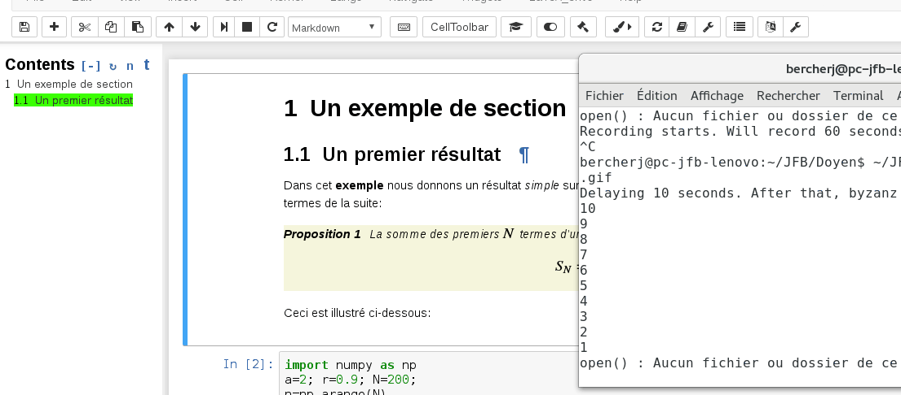

# nbTranslate -- helps translate notebooks -- provides multilanguage support

This extension

- helps convert markdown cells in a notebook from one language to another (optionally using **Google translate**),
- enables one to selectively display cells from a given language in a multilanguage notebook. 

This extension allows one to copy the original cell into a new one for editing and translating. Optionally, the cell source text can be piped through `google translate` and the result inserted into a new cell. Basic markdown structures (e.g. bold, italics, lists) are preserved/restored after conversion, though this is not perfect (usually one has to correct the text and structures afterwards). Similarly, equations are extracted before conversion and restored in the result. It seems that when translating from one language to another language, the best results are obtained by using English as an intermediate language.

Metadata indicating the language used is added to each cell. This allows one to selectively display cells for a particular language and hide the other ones. Code cells remain untouched. This way, one can get a kind of multilanguage notebook. A menu is provided to select the languages to display in the notebook. 





## Compatibility

The extension has been written to play nicely with
- [latex_envs]: LaTeX environments are protected before conversion and restored after. For environments with text content, e.g. theorem, remark, etc, the content is still translated. Some minor updates have been applied to `latex_envs` to ensure the best compatibilty; update if necessary via 
```
pip install jupyter_latex_envs --upgrade [--user|sys-prefix]
jupyter nbextension install --py latex_envs --user
jupyter nbextension enable latex_envs --user --py
```
- [toc2]: cells of non displayed languages are hidden and not rendered so that the toc corresponds only to the selected languages. The toc is automatically updated each time a language is added or removed. 

## Configuration
- Parameter values can be changed using the `nbextensions-configurator`: it is possible to choose the initial source and target language, to choose to use the google translate engine or not, and to specify the initially displayed languages, the position of the language selection menu, and a keyboard shortcut definition.
- A *configuration toolbar* is provided which allows changing the main options per notebook. One can also toggle whether to use the google translate engine, select the source and target languages, and select the language to display. 

## Export 
It is possible to extract one language from the multilanguage notebook. An exporter with an entry-point `selectLanguage` is provided that converts the notebook into another one as follows:
```
jupyter nbconvert --to selectLanguage --NotebookLangExporter.language=lang  FILE.ipynb 
```
where the `lang` parameter denotes a valid language abbreviation e.g. en, fr, ar, sp. See the full list <a href='languages.js'> here.</a>


Installation
------------

If you use [jupyter-contrib-nbextensions](https://github.com/ipython-contrib/jupyter_contrib_nbextensions), the extension is provided within the `Nbextensions` configuration. 

Otherwise, you can still install the extension from my personal repo, using:
```
jupyter nbextension install https://rawgit.com/jfbercher/jupyter_nbTranslate/master/nbTranslate.zip --user
jupyter nbextension enable nbTranslate/main
```
_Note: Until further notice, installing from this repo does not install the python module and add the entry points for exporting as described above._

To uninstall:
```
jupyter nbextension uninstall nbTranslate/main
```
