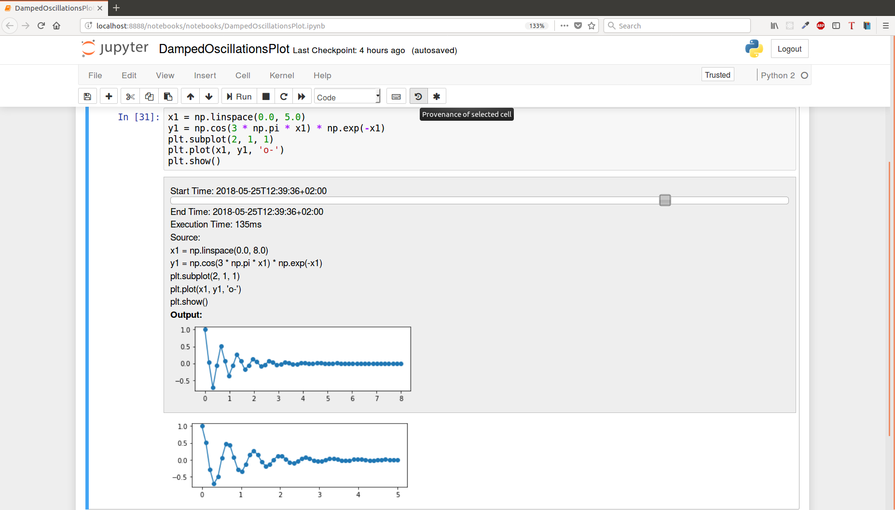
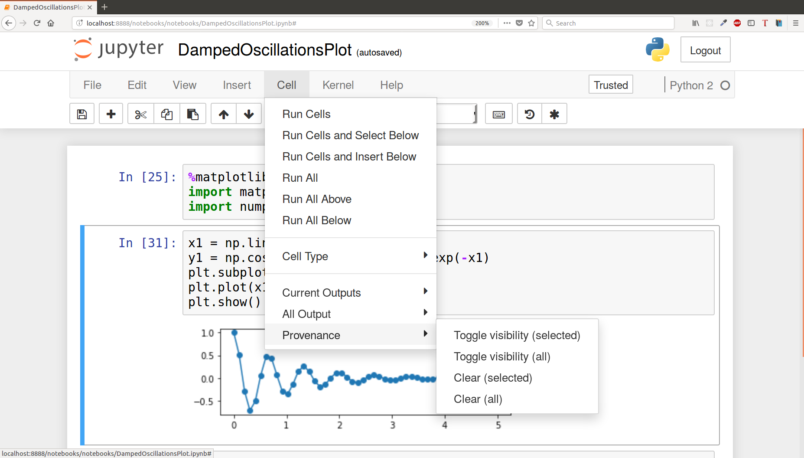

ProvBook: Provenance of the Notebook.
============

This extension displays the provenance of each notebook cell execution.
Every cell is extended with a provenance area with a slider. The provenance area shows the history of the execution of each code cells. As you move the slider, you could see the start and end time of each execution, how long it took to execute, the number of runs, the source, and output of each execution. It also shows the provenance of text cells where it shows the modified time and the source.

Installation
-------------
```bash
jupyter nbextension install provbook
jupyter nbextension enable provbook/main
```
Usage
-----
The provenance of a code cell. The screenshot shows the toolbar button for the displaying the provenance of selected or all cells.


The Provenance Menu.
A user can toggle the provenance display for a selected cell from Cell -> Provenance -> Toggle visibility (selected).
A user can clear the provenance data from the metadata of the notebook from Cell -> Provenance -> Clear (all).


Demo
----
A video showing the installation and use of ProvBook with an example is available [here](https://doi.org/10.6084/m9.figshare.6401096) 


Publication
-----------
ProvBook: Provenance-based Semantic Enrichment of Interactive Notebooks for Reproducibility, Sheeba Samuel and Birgitta König-Ries, The 17th International Semantic Web Conference (ISWC) 2018 Demo Track, Monterey, California, USA


Internals
-----------
The provenance is stored in the metadata of the notebook. Every time a code cell is executed, a new entry 'provenance' is added to the metadata of the code cell. The start and end time of the execution is added with the time it took to execute. The source and the output obtained from executing the cell is added to the metadata so that it can be shared with other collaborators to verify the output.
