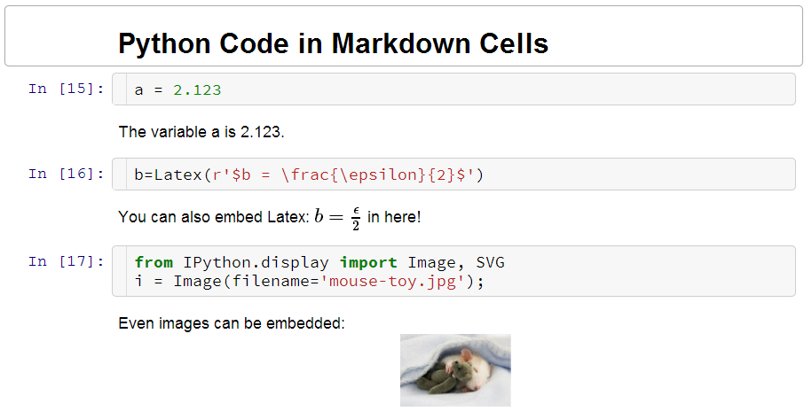

Python Markdown
===============

The **Python Markdown** extension allows displaying output produced by the currently kernel
in markdown cells. The extensions is basically agnostic to the kernel language, however most
testing has been done using Python.

For example:
If you set variable `a` in Python

```Python
a = 1.23
```

and write the following line in a markdown cell:

```Markdown
a is {{a}}
```

It will be displayed as:

```Markdown
a is 1.23
```

[](https://youtu.be/_wLwLsgkExc)

The notebook needs to be trusted in order to execute Python commands in markdown.
This is indicated by the "trusted" check mark:


If you see the "unstrusted" question mark, use File->Trust Notebook in the menu.

**Caution: If you trust a notebook, you allow it to execute any code that is contained between the `{{...}}` 
curly braces on your notebook server.**


Further examples
----------------

Before rendering the markdown cell:


After rendering the markdown cell:



Code is only executed when the notebook is trusted. So if your original code is shown as 
rendered markdown output, please make sure your notebook is trusted. You can check if the notebook
is trusted by looking at the check mark at the top of the window. 

**Caution:** There is no restriction in the expression you can embedd between the curly braces `{{ }}`. 
Be careful as you might crash your browser if you return too large datasets, or worse.


Exporting
---------

In order to have `nbconvert` show the computed output when exporting to another format,
use the `pre_pymarkdown.py` preprocessor. If you used the `python setup.py install` command to install the
IPython-contrib extension package, this will already be installed.

For manual setup, you need to copy this file to a location within the Python path (or extend `PYTHONPATH`).
Additionally, you need to add these two lines to your `jupyter_nbconvert_config.py` configuration file:

```Python
c = get_config()
c.Exporter.preprocessors = ['pre_pymarkdown.PyMarkdownPreprocessor']
```


Internals
---------

The extension overrides the `textcell.MarkdownCell.prototype.render` function and searches for the expression enclosed 
in double curly braced `{{ <expr> }}`. It then executes the expression and replaces it with the result returned from 
the running kernel, embedded in a `<span>` tag.
Additionally, the result is saved in the metadata of the markdown cell, i.e. `cell.metadata.variables[varname]`.
This stored value is displayed when reloading the notebook and used for the nbconvert preprocesser.

The preprocessor `pre_pymarkdown.PyMarkdownPreprocessor` allows `nbconvert` to display the computed variables
when converting the notebook to an output file format.

Unfortunately, embedding in LaTeX is not supported currently, as computing expressions between the curly braces
and rendering LaTeX equations is happening asynchronously, and it is difficult to handle this in a consistent way.
Ideas or pull request to implement this functionality are welcome.
 