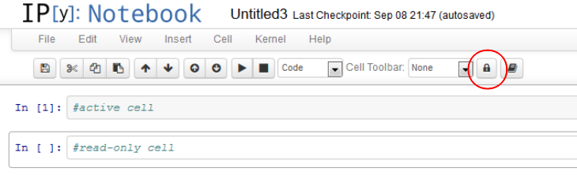

Read-only
=========

Clicking on the lock symbol makes the current cell read-only.
This means it can be executed, but the input area cannot be altered.
This behavior is persistant, as the information is stored as metadata in the
ipynb file.
When the read-only nbextension is not loaded, the read-only information is kept,
but not applied to the cell.

Internals
---------

The read-only status is compatible with runtools nbextension, and stored in the
metadata field of each codecell, for example:

	cell.metadata.run_control.read_only = true
