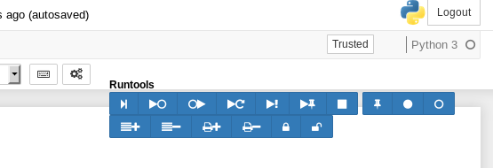
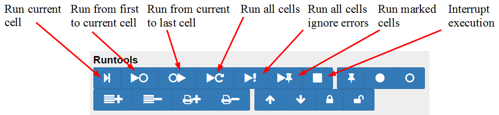
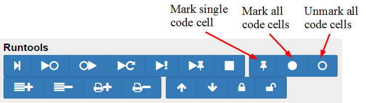
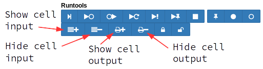

Runtools
========
Runtools provide a number of additional functions for working with code cells in the IPython notebook:

Code Cell Execution
-------------------

* Execute a single cell
* Execute from top cell to currently selected cell
* Execute from currently selected cell to bottom cell
* Execute all cells
* Execute all cells, ignore exceptions (requires https://github.com/ipython/ipython/pull/6521)
* Execute marked code cells (cells with green gutter area are marked)
* Stop execution (duplicate to standard toolbar button)


Code Cell Marking
-----------------

* Mark one or more code cell


Code Cell Display
-----------------

* Hide or show input (i.e. the source code) of marked code cells
* Hide or show output of marked code cells


Description
-----------

The *runtools* extension adds a button to turn on/off a floating toolbar:   


This adds Code execution buttons:   


Codecells can be marked by clicking on the gutter of a codecell or by clicking on the markers toolbar:   


Marked codecells can be locked to read-only mode and moved upd and down:   


The input and output areas of marked codecells can be hidden:   


A IPython notebook with marked cells looks like this:


Internals
---------

New metadata elements added to each cell:
* `cell.metadata.hide_input` - hide input field of the cell
* `cell.metadata.hide_output` - hide output field of the cell
* `cell.metadata.run_control.marked` - mark a codecell

To export a notebook with hidden input/output fields, the custom template `hide_input_output.tpl` is required.
It should have been installed in the `templates` folder.
You can find the `templates` folder of `jupyter_contrib_nbextensions` from python using

```python
from jupyter_contrib_nbextensions.nbconvert_support import templates_directory
print(templates_directory())
```

The template needs to be in a path where nbconvert can find it. This can be your local path or specified in 
`jupyter_nbconvert_config` or `jupyter_notebook_config` as `c.Exporter.template_path`, see [Jupyter docs](http://jupyter-notebook.readthedocs.io/en/latest/config.html).

For HTML export a template is provided as `nbextensions.tpl` in the `jupyter_contrib_nbextensions` templates directory. Alternatively you can create your own template:
```





{{ super() }}






{{ super() }}


```

For LaTeX export a different template is required, which is included as `nbextensions.tplx` in the `jupyter_contrib_nbextensions` templates directory. Alternatively you can create your own template:
```
((- extends 'report.tplx' -))

((* block input_group -))
((- if cell.metadata.hide_input -))
((- else -))
((( super() )))
((- endif -))
(( endblock input_group *))

((* block output_group -))
((- if cell.metadata.hide_output -))
((- else -))
((( super() )))
((- endif -))
(( endblock output_group *))
```