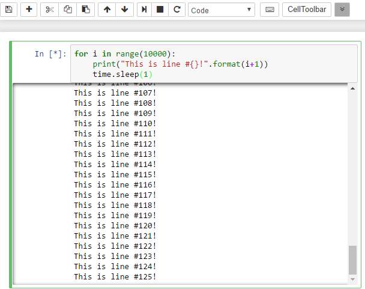

# ScrollDown

When enabled, this nbextension scrolls cells' outputs down automatically as
they are enlarged. It can be enabled and disabled using the toolbar button:

Options
-------

The enabled status is toggleable with the toolbar button, which sets the option
option `scrollDownIsEnabled` in the notebook config section.
