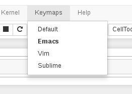

Select CodeMirror Keymap
=======

This extension lets you choose between the available CodeMirror keymaps: default, emacs, vim, and sublime

There's a chance that this might cause key conflicts, especially with other extensions

Based on:
 * [jupyter-emacskeys](https://github.com/rmcgibbo/jupyter-emacskeys)
 * [notebook_input_mode](https://github.com/asford/notebook_input_mode)