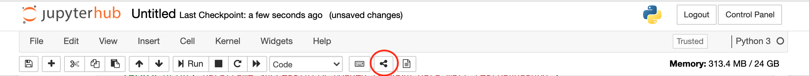

ShareLink
=========
This extension adds a toolbar button to copy the shareable link to another user that have access to the notebook.

link preview: https://\<URL>/hub/user-redirect/notebooks/shared_folder/Untitled.ipynb?kernel_name=python3