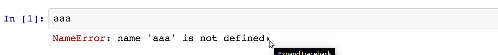

Skip traceback
==============
This extension hides Python tracebacks and only displays the error type an name.

Example
-------
With extension enabled:

   
With extension disabled:

After loading the extension, only newly executed cells are affected. Previous tracebacks will remain visible until the
 corresponding cell is executed again.

If you press the button on the toolbar with the exclamation mark, you can temporarily turn on tracebacks again.

Internals
---------

This extensions works by overriding the `OutputArea.prototype.append_error` function, replacing it with a new function
 that only displays the error type and message.
