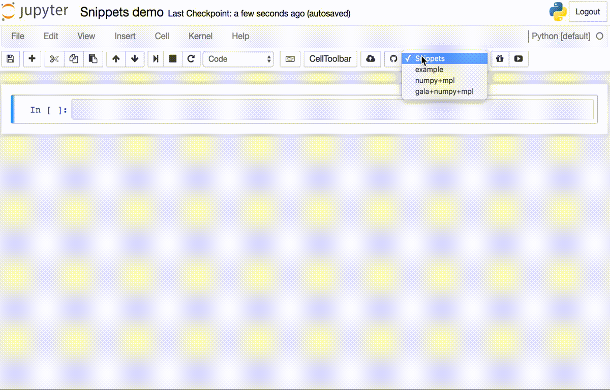

Snippets
========

Code cell snippets.

This extension adds a drop-down menu to the IPython toolbar that allows easy
insertion of code snippet cells into the current notebook. The code snippets
are defined in a JSON file in `nbextensions/snippets/snippets.json` and an
example snippet is included with this extension.



Adding new snippets
-------------------

Snippets are specified by adding a new JSON block to the list of existing snippets in `$(jupyter --data-dir)/nbextensions/snippets/snippets.json`. For example, to add a new snippet that imports numpy, matplotlib, and a print statement, the JSON file should be modified from:

```json
{
    "snippets" : [
        {
            "name" : "example",
            "code" : [
                "# This is an example snippet!",
                "# To create your own, add a new snippet block to the",
                "# snippets.json file in your jupyter data directory under nbextensions:",
                "# $(jupyter --data-dir)/nbextensions/snippets/snippets.json",
                "import this"
            ]
        }
    ]
}
```

to this:

```json
{
    "snippets" : [
        {
            "name" : "example",
            "code" : [
                "# This is an example snippet!",
                "# To create your own, add a new snippet block to the",
                "# snippets.json file in your jupyter data directory under nbextensions:",
                "# $(jupyter --data-dir)/nbextensions/snippets/snippets.json",
                "import this"
            ]
        },
        {
            "name" : "some imports",
            "code" : [
                "import numpy as np",
                "import matplotlib as mpl",
                "print('spam')"
            ]
        }
    ]
}
```
You may need to restart your notebook for the changes to take effect.
