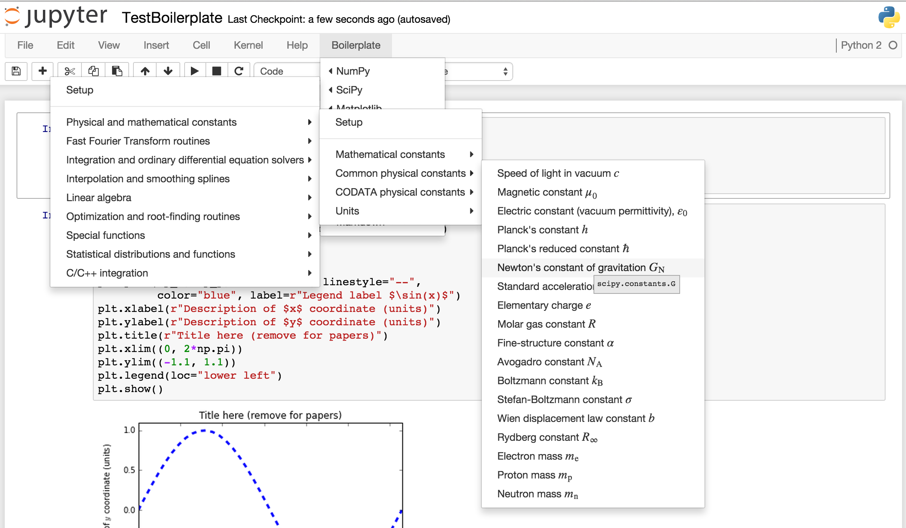
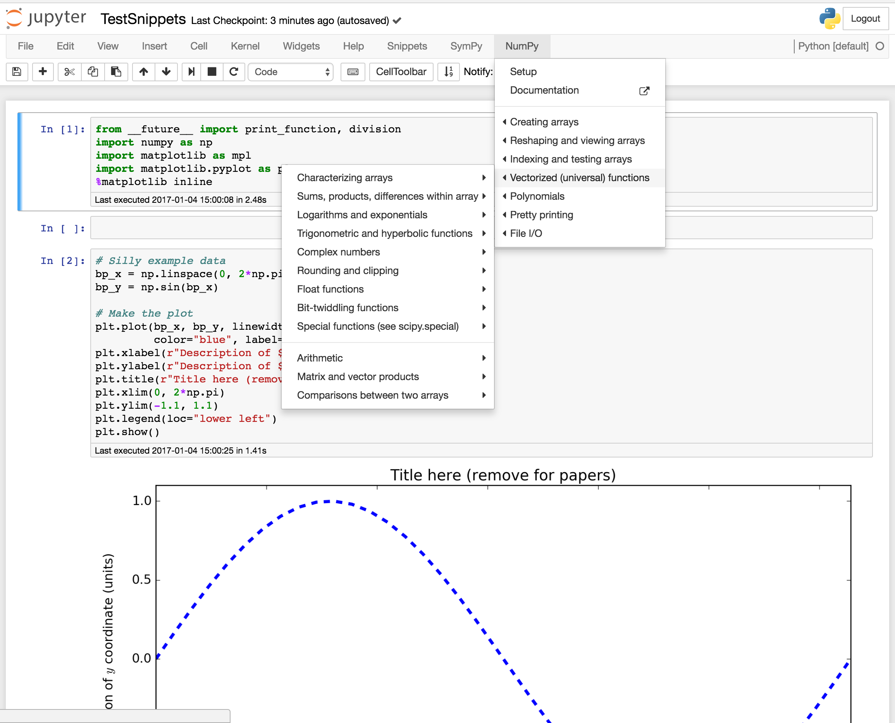
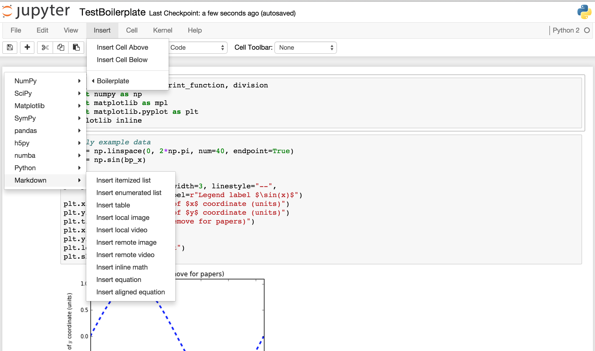

Jupyter notebook snippets menu
==============================

Adds a customizable menu item to Jupyter notebooks to insert
snippets, boilerplate, and examples of code.



This notebook extension adds a menu item (or multiple menu items, if
desired) after the `Help` menu in Jupyter notebooks.  This new menu
contains little snippets of code that we all forget from time to time
but don't want to google, or are just too lazy to type, or simply
didn't know about.  It can also be helpful for people just starting
out with a programming language, who need some ideas for what to do
next — like importing a module, defining variables, or calling
functions.

The new menu comes with a default value relevant for python
programming — especially scientific computing — though this is fully
user-configurable as detailed below.  The default menu is named
`Snippets`, and contains sub-menus with snippets for a few popular
python packages, as well as python itself, and some notebook markdown.
(Note that some of the menus are so large that it is necessary to move
the first-level menus to the left so that lower-level menus will fit
on the screen.  This behavior is also user-configurable, as discussed
in detail [below](#change-direction-of-sub-menus).)

So, for example, if you are editing a code cell and want to import
matplotlib for use in the notebook, you can just click the `Snippets`
menu, then mouse over "Matplotlib".  This will open up a new sub-menu,
with an item "Setup for notebook".  Clicking on that item will insert
the code snippet at the point where your cursor was just before you
clicked on the menu.  In particular, for this `matplotlib` example,
the following code gets inserted:

```python
import numpy as np
import matplotlib as mpl
import matplotlib.pyplot as plt
%matplotlib inline
```

The inserted text will be selected, so that you can delete it by
pressing backspace or delete, or you can just select another snippet
to replace it -- and just to highlight what was inserted.

Note that many of the snippets involve variable names prefixed with
`bp_`.  For example, a new numpy array is created as `bp_new_array`.
These are intentionally dumb names that you really should replace.
Failing to do so could lead to ugly bugs in your code if you use
multiple boilerplate snippets with clashing variable names.

Similarly, some strings are intended to be replaced, such as the axis
labels in plots.  These are there to show you what can be done, and to
remind you to put informative labels in your plots.  If you don't
want, e.g., a title on your plot, just remove that line.


Installation
------------
To install this extension alone (without the [main collection of nbextensions](https://github.com/ipython-contrib/jupyter_contrib_nbextensions)), run the following from the command line:

```bash
git clone git://github.com/moble/jupyter_boilerplate
jupyter nbextension install jupyter_boilerplate
jupyter nbextension enable jupyter_boilerplate/main
```

You can then disable the extension if you want with
```bash
jupyter nbextension disable jupyter_boilerplate/main
```


Basic menu customization
------------------------

The default menu might have too many irrelevant items for you, or may
not have something you would find useful.  You can easily customize it
in the
[jupyter_nbextensions_configurator](https://github.com/Jupyter-contrib/jupyter_nbextensions_configurator#usage),
which you almost certainly have if you installed this extension the
normal way,
through
[jupyter_contrib_nbextensions](https://github.com/ipython-contrib/jupyter_contrib_nbextensions).
Usually, you can get to the configurator by pointing your browser to
http://127.0.0.1:8888/nbextensions, though you may have to modify the
URL if you use a more complicated jupyter server.

On the configurator page, you will see a number of options (as well as
this README) that should be fairly self-explanatory, allowing you to
remove any of the default menu items, or add a custom menu within the
"Snippets" menu.  The custom menu is written in JSON, and a simple
(and useless) example is given that should be easy to modify as
needed.


Advanced menu customization
---------------------------

It is also possible to extensively customize the menus in far more
complex ways using your `custom.js` file.  For example, you can change
the order of menu items, add more custom sub-menus under the
"Snippets" menu, and custom menus alongside "Snippets" in the menu
bar, or even add menus in other places, like inside the "Insert" menu.

You can find the path to `custom.js` by running the command

```bash
echo $(jupyter --config-dir)/custom/custom.js
```

For Mac and linux users, the result is probably
`~/.jupyter/custom/custom.js`.  If this file or the directory
containing it do not exist, you can simply create them.

The customization process is best explained through examples, which
are available in the `examples_for_custom.js` file in this directory.
Note that there's a lot of explanation here, but it's all actually
pretty simple.  Give it a try, and you'll pick it up quickly.  Note
that using this method can make it so that options selected in the
configurator are ignored.

The theory behind this customization is that the menu is represented
by a nested JavaScript array (which is just like a python list).  So
to change the menu, you just need to change that array.  And each menu
*item* inside this array is represented by
a [JavaScript "object"](https://api.jquery.com/Types/#Object) (which is
just like a python dictionary).  So to change a menu item, you just
have to change that object.

Again, this makes more sense when looking at example, as follows.


### Add a custom sub-menu with simple snippets

Suppose you want to make a new sub-menu with your favorite snippets at
the bottom of `Snippets`.  You create a new object for the menu item,
and then just "push" it onto the default menu.  Do this by inserting
some lines into your `custom.js`, so that it looks like this:

```javascript
require(["nbextensions/snippets_menu/main"], function (snippets_menu) {
    console.log('Loading `snippets_menu` customizations from `custom.js`');
    var horizontal_line = '---';
    var my_favorites = {
        'name' : 'My favorites',
        'sub-menu' : [
            {
                'name' : 'Menu item text',
                'snippet' : ['new_command(3.14)',],
            },
            {
                'name' : 'Another menu item',
                'snippet' : ['another_new_command(2.78)',],
            },
        ],
    };
    snippets_menu.options['menus'] = snippets_menu.default_menus;
    snippets_menu.options['menus'][0]['sub-menu'].push(horizontal_line);
    snippets_menu.options['menus'][0]['sub-menu'].push(my_favorites);
    console.log('Loaded `snippets_menu` customizations from `custom.js`');
});
```

Now, if you refresh your notebook, you'll see a new menu item named "My
favorites".  Hover over it, and it will pop up a sub-menu with two more
options.  Click the first one, and it will insert `new_command(3.14)` into
your notebook wherever the cursor was.

We discuss how all this works below.  But first, we need to slightly generalize
the example above to work with more complicated snippets.


### More complicated snippets

The example above inserted simple one-line snippets of code.  Those snippets
didn't have any quotation marks (single or double), backslashes, or newlines,
which made everything easy.  Unfortunately, JavaScript doesn't deal too well
with strings.  (There are no raw triple-quoted strings, like in python.)  So
there are just three things to remember when writing snippets.

  1. Quotation marks can be a tiny bit tricky.  There are a few options:
    1. The obvious option is to enclose your snippets in single quotation marks
       (`'`), and use only double quotation marks (`"`) within the snippet
       itself.
    2. Just as easy is to enclose your snippets in double quotation marks
       (`"`), and use only single quotation marks (`'`) within the snippet
       itself.
    3. You can also escape single quotation marks inside single quotation marks
       as `\'`.

  2. Newlines are even trickier, but the extension takes care of this for you
     as long as you put separate lines of code as separate elements of the
     `snippet` array.  Generally, there's no reason to put a literal newline in
     your snippets.

  3. JavaScript will treat backslashes as if they're trying to escape whatever
     comes after them.  So if you want one backslash in your output code,
     you'll need to put two backslashes in.

This is all best described with another example.  Let's change the first
function above, to give it some more lines and some quotes:

```javascript
require(["nbextensions/snippets_menu/main"], function (snippets_menu) {
    console.log('Loading `snippets_menu` customizations from `custom.js`');
    var horizontal_line = '---';
    var my_favorites = {
        'name' : 'My $\\nu$ favorites',
        'sub-menu' : [
            {
                'name' : 'Multi-line snippet',
                'snippet' : ['new_command(3.14)',
                             'other_new_code_on_new_line("with a string!")',
                             'stringy(\'escape single quotes once\')',
                             "stringy2('or use single quotes inside of double quotes')",
                             'backslashy("This \\ appears as just one backslash in the output")',
                             'backslashy2("Here are \\\\ two backslashes")',],
            },
            {
                'name' : 'TeX appears correctly $\\alpha_W e\\int_0 \\mu \\epsilon$',
                'snippet' : ['another_new_command(2.78)',],
            },
        ],
    };
    snippets_menu.options['menus'].push(snippets_menu.default_menus[0]);
    snippets_menu.options['menus'][0]['sub-menu'].push(horizontal_line);
    snippets_menu.options['menus'][0]['sub-menu'].push(my_favorites);
    console.log('Loaded `snippets_menu` customizations from `custom.js`');
});
```

Note the code output by the first item contains all sorts of interesting
strings.  Also, the menu title of the second item contains TeX, which will
display correctly, and is used in some of the default menus to show the
standard symbols for physical constants.  For more examples, look at the
default menus stored in the `snippets_menu` directory -- mostly under `python`.


### How it works: Creating new menu items

Each of the menu items above is a JavaScript object (like a python `dict`),
with some attributes -- `name` and `sub-menu` for the main menu item, and
`name` and `snippet` for the sub-menu items.  In general, any menu object can
have any of the following properties:

  1. `name`: Text that appears in the menu.  Note that this can include latex,
     as the menus are processed by MathJax after being loaded.
  2. `sub-menu`: An array of more menu items
  3. `snippet`: An array of strings turned into code when the menu item is
     clicked
  4. `internal-link`: Link to some place on the present page.  For example,
     this could be `#References`, to link to the `References` section of any
     notebook you're in.
  5. `external-link`: This just a link to some external web page, which will be
     identified with a little icon, just like in the standard notebook "Help"
     menu.  When clicked, the link will open in a new window/tab.
  6. `menu-direction`: If the value of this property is `left`, this menu's
     sub-menus open on the left.  This is useful when the top-level menu is
     inserted as an item within other menu items.  See
     [below](#change-direction-of-sub-menus) for examples.
  7. `sub-menu-direction`: If the value of this property is `left`, sub-menus
     within this menu's sub-menus open on the left.  This is used by default
     for items under the `Snippets` menu to help ensure that nested menus
     don't become too large to fit on the screen.  See
     [below](#change-direction-of-sub-menus) for examples.

The `name` property is the only required one, though you'll probably want at
least one other property.  The `sub-menu` contains menu objects that again may
have any of these properties, so you can easily nest menus.  You can also
combine a `snippet` with a `sub-menu`, so that there's a default value as well
as a sub-menu.  However, the last three are mutually exclusive: `snippet` will
override any `-link`; an `internal-link` will override an `external-link`.


### How it works: Splicing new menu items into the old

Besides just creating the menu items, we may want to join together previously
created items.  That's the purpose of this line in the code above:

```javascript
    snippets_menu.options['menus'][0]['sub-menu'].push(my_favorites);
```

This uses
the [JavaScript `push`](https://www.w3schools.com/jsref/jsref_push.asp)
function to insert the new menu `my_favorites` menu into the last slot
of `snippets_menu.options['menus'][0]['sub-menu']`, which is the set
of menus under the heading `Snippets`.

If you think about this last point, you'll realize that `Snippets` is
just the `0` slot of an array of menus.  If you want a new menu right
in the menu bar, you could add `my_favorites` right to that top-level
array, with something like this:

```javascript
    snippets_menu.options['menus'].push(snippets_menu.default_menus[0]);
    snippets_menu.options['menus'].push(my_favorites);
```

This would place your favorites after the default `Snippets` menu; to
put it before, just swap the order in which you `push`:

```javascript
    snippets_menu.options['menus'].push(my_favorites);
    snippets_menu.options['menus'].push(snippets_menu.default_menus[0]);
```

(In general, to add a new element at a given index of an array, you
could also just use
the [splice](https://www.w3schools.com/jsref/jsref_splice.asp)
function.)

This might be useful if you have one set of very frequently used
commands, and want immediate access, without going through various
levels of the usual menu.  A useful example of this is
shown [below](#starting-over-with-the-menus).  The `splice` function
can also be used to delete items from the array, as
described [next](#deleting-menu-items).


### Other menu manipulations

To rearrange menu items, just use standard JavaScript techniques.  The two most
likely examples are deleting and rearranging menu items, but we'll also see
that other manipulations are easy.  We can also change where the new menus go,
and what they look like.

#### Deleting menu items

To delete an item, just `splice` nothing into it.  Let's suppose, for example,
that you want to remove the option to set up matplotlib for a script, which is
the `1` item of the "Matplotlib" menu:

```javascript
snippets_menu.python.matplotlib['sub-menu']
```

Remember that `[1]` is the second element of "Matplotlib"'s sub-menu
list.  So the following code will do the trick


```javascript
require(["nbextensions/snippets_menu/main"], function (snippets_menu) {
    console.log('Loading `snippets_menu` customizations from `custom.js`');
    snippets_menu.python.matplotlib['sub-menu'].splice(1, 1); // Delete 1 element starting at position 1 of the sub-menu
    console.log('Loaded `snippets_menu` customizations from `custom.js`');
});
```

The first `1` in the argument to `splice` says to work on the element at
position 1; the second `1` says to delete 1 element of the array.


#### Rearranging menu items

Following the example above, suppose you don't want to delete the second setup
item under "Matplotlib", but instead want to swap those first two items.  To
make this swap, you need to do the usual trick of storing one element in a
temporary variable, and then reassign appropriately.  The following code
achieves this purpose:

```javascript
require(["nbextensions/snippets_menu/main"], function (snippets_menu) {
    console.log('Loading `snippets_menu` customizations from `custom.js`');
    var tmp = snippets_menu.python.matplotlib['sub-menu'][0];
    snippets_menu.python.matplotlib['sub-menu'][0] = snippets_menu.python.matplotlib['sub-menu'][1];
    snippets_menu.python.matplotlib['sub-menu'][1] = tmp;
    console.log('Loaded `snippets_menu` customizations from `custom.js`');
});
```

#### Change direction of sub-menus

Each sub-menu may be placed to the right or left side of the menu item
containing it.  This is controlled by the `menu-direction` and
`sub-menu-direction` properties of the container.  By default, both are set to
`right` for all menus, but `sub-menu-direction` is set to `left` for the
default `Snippets` menu, which means that all of its sub-menus open to the
left side.  This is important because the menus may be nested quite deeply, and
need to fit on the screen.  For example, the SciPy CODATA constants and SymPy's
orthogonal functions will easily extend far past the right-hand edge of the
notebook without this feature.  That means the window size would abruptly
increase when you mouse over these menus, and would abruptly collapse when you
mouse out of them.  So by opening them to the left, we gain enough space to
keep everything on the screen.

But these are configurable properties.  If, for example, you want to change the
default menus to open on the right (which would be the more standard behavior),
you can use this:

```javascript
    snippets_menu.default_menus[0]['sub-menu-direction'] = 'right';
```

This may be particularly useful if we change the position of the menus, as in
the next examples.


#### Starting over with the menus

Each of the menu items under the default `Snippets` menu is
individually available as part of the `snippets_menu` object defined
in our JavaScript examples.  So if you want, you could just use them
to build your own version of the menu.  For example, suppose use SymPy
and Numpy most frequently, so you want easy access to their menus,
without having to click `Snippets` first.  And then suppose you still
want most of the other `Snippets` items, but less frequently so they
can stay in their menu, except that you really never use pandas.  You
can create your own menu as follows:

```javascript
require(["nbextensions/snippets_menu/main"], function (snippets_menu) {
    console.log('Loading `snippets_menu` customizations from `custom.js`');
    snippets_menu.default_menus[0]['sub-menu'].splice(3, 2); // Remove SymPy and pandas
    snippets_menu.python.sympy['sub-menu-direction'] = 'left'; // Point new SymPy menus to left
    snippets_menu.python.numpy['sub-menu-direction'] = 'left'; // Point new Numpy menus to left
    snippets_menu.options['menus'].push(snippets_menu.default_menus[0]); // Start with the remaining "Snippets" menu
    snippets_menu.options['menus'].push(snippets_menu.python.sympy); // Follow that with a new SymPy menu
    snippets_menu.options['menus'].push(snippets_menu.python.numpy); // Follow that with a new Numpy menu
    console.log('Loaded `snippets_menu` customizations from `custom.js`');
});
```

The default menu group is `snippets_menu.default_menus`, and the SymPy sub-menu
is `snippets_menu.python.sympy`.  You can see that we've manipulated them above
by removing two elements from the default menu, using the `splice` command.
We've also added a new property to the SymPy menu to make its sub-menus open to
the left, instead of the right -- which is necessary to keep all of SymPy's
extensively nested menus on the screen.  (In fact, the list of orthogonal
polynomials under "Special functions" in the SymPy menu are some of the widest
menus in the default set.)  Finally, we've combined the modified default menu
with the modified SymPy menu into one new list.

This gives us the original `Snippets` menu with SymPy and pandas removed, as
well as new menus devoted to just SymPy and Numpy right in the menu bar:



You can see that the two items are indeed removed from `Snippets`, and
"SymPy" and "Numpy" now have places of honor right in the menu bar.
You can, of course, swap their order in the code above, or make any
number of further alterations.


#### Changing the insertion point

You might want to change the order of the menus in the navbar (that
top-level bar with "File", etc.).  For example, it might feel
particularly natural to have "Help" as the last item, so maybe you'd
prefer to put the `Snippets` menu *before* the "Help" menu.  Or you
may prefer to maintain the structure of the menus in the navbar, and
would rather have the `Snippets` menu *inside* of some other top-level
menu -- like the "Insert" menu.  Personally, I prefer to have the
`Snippets` menu in its default position for easy access.  But it's
certainly possible to put it other places.

To help do this, there are two additional options available, which can
be set either in the configurator or in `custom.js`.  Their default
values give us the usual placement of the `Snippets` menu; by giving
them different values, we can change the placement.  These options are

  1. `sibling`: This is an HTML node next to our new menu,
     presumably
     [selected with `jQuery`](https://learn.jquery.com/using-jquery-core/selecting-elements/).
     The default value is `$("#help_menu").parent()`, which is the
     "Help" menu.  For the configurator, `.parent()` is automatically
     appended.
  2. `insert_before_sibling`: This is just a string controlling where
     the new menu will be inserted relative to its sibling. The
     default value is `false`.  If you change it to `true`, the new
     menu will be inserted before the sibling.

So placing the `Snippets` menu *before* the "Help" menu is as easy as
checking the box for that second option.  For more complicated uses,
you may need to set these values from `custom.js`.  For example, f you
want to put the new `Snippets` menu as an item inside the standard
"Insert" menu, and include an additional horizontal divider, you can
use this:

```javascript
require(["nbextensions/snippets_menu/main"], function (snippets_menu) {
    console.log('Loading `snippets_menu` customizations from `custom.js`');
    snippets_menu.default_menus[0]['menu-direction'] = 'left'; // Open top-level menu to the left...
    snippets_menu.default_menus[0]['sub-menu-direction'] = 'right'; // ...and sub-menus to the right.
    snippets_menu.options['menus'].push('---', snippets_menu.default_menus[0]); // Add horizontal line and default menus
    snippets_menu.options['sibling'] = $("#insert_cell_below"); // Find the place at which to insert the new menus
    console.log('Loaded `snippets_menu` customizations from `custom.js`');
});
```

Here's what that looks like:



And of course, you can combine this selection of the insertion point with other
techniques above, where you change the content of the menus.


#### Multiple menus in separate locations

Finally, we have one more interesting example that brings together various
threads from the previous examples.  It is possible to place multiple menus in
different locations.  For example, suppose we want to combine two of the examples
above, where [(1)](#starting-over-with-the-menus) we separated "SymPy" into its
own menu on the navbar, and [(2)](#changing-the-insertion-point) we placed the
`Snippets` menu inside the "Insert" menu.  That is, you might want "SymPy"
to be conveniently placed, but you want the rest of the `Snippets` to stay
under the "Insert" menu.

To add these two separate menus, we place the first with the usual
approach, and then place the second with another function,
`snippets_menu.menu_setup`.  The former is mostly just a wrapper to
the latter, except that it also inserts JavaScript and CSS elements
into the notebook.  Note that `menu_setup` does not have any default
values; you must always pass the `sibling` and `insert_before_sibling`
arguments.

So, putting it all together, the code needed for this arrangement is as
follows:

```javascript
require(["nbextensions/snippets_menu/main"], function (snippets_menu) {
    console.log('Loading `snippets_menu` customizations from `custom.js`');
    var sympy_menu = [snippets_menu.python.sympy,];
    sympy_menu[0]['sub-menu-direction'] = 'left';
    snippets_menu.options['menus'] = sympy_menu;
    snippets_menu.default_menus[0]['sub-menu'].splice(3, 1); // Remove SymPy from defaults
    snippets_menu.default_menus[0]['menu-direction'] = 'left';
    snippets_menu.default_menus[0]['sub-menu-direction'] = 'right';
    var sibling = $("#insert_cell_below");
    var inserted_menu = [
        '---',
        snippets_menu.default_menus[0],
    ];
    snippets_menu.menu_setup(inserted_menu, sibling, 'after');
    console.log('Loaded `snippets_menu` customizations from `custom.js`');
});
```


Troubleshooting
---------------

The first step is to make sure that the default setup can be loaded.
Comment out whatever you've got in `custom.js`, and add in the simple
configuration from [the beginning](#installation).  If that doesn't
work, try the following steps
suggested
[here](http://jupyter-contrib-nbextensions.readthedocs.io/en/latest/troubleshooting.html):

  1. Clear your browser cache or start a private browser tab.
  2. Verify your `custom.js` is the one the notebook is seeing, by opening it
     in the browser: <http://127.0.0.1:8888/static/custom/custom.js> (as
     opposed to looking at the file directly outside of your browser, which may
     not be the `custom.js` loaded if you are using a `virtualenv`).
  3. Verify the extension can be loaded by the Jupyter notebook, for example:
     <http://127.0.0.1:8888/nbextensions/snippets_menu/main.js>.  You
     should see a page with lots of JavaScript code, and should *not*
     see a 404 error.
  4. Check for error messages in the JavaScript console.

Now, assuming the basic installation works, it must be something wrong
in your customization.  (Or maybe a new bug you've uncovered...)

Sometimes, the menu(s) might simply not appear.  This is most likely
due to a syntax error in your menu.  You can find out in Chrome by
going to "View" -> "Developer" -> "JavaScript console".  You'll see a
bunch of output.  Red lines are usually errors (some of which are
probably *not* due to your menu error).  On the right side of those
lines, you'll see the file where the error came from, and possibly
even the line number that's causing the trouble.  Find an error that
links to either `snippets_menu/main.js` or `custom.js`, and click on
it.  Then try to figure out what went wrong.  The most common error
I've encountered is "Unexpected string", which might indicate a
missing comma, or an improperly escaped quote.  Note that sometimes
the error will point to the first thing *after* the real problem.

Or maybe the menu did appear, but it doesn't work properly.  You can
also inspect the actual elements that were inserted.  Click on
"Elements" in that Developer Tools tab that opened at the bottom of
your window.  Then click the magnifying glass, and click on the
`Snippets` menu.  This will jump the Developer Tools to the part of
the source with that menu.  Scroll through to find the menu item
that's not working correctly, and take a look at it.  The text in the
`data-snippet-code` attribute is especially important, since that's
what gets inserted into the notebook.


TODO
----

There's a bunch of stuff I still need to do, listed in
the
[issue tracker](https://github.com/moble/jupyter_boilerplate/issues).
If you find a bug or have an idea for a good snippet that you think
should be added to the defaults, feel free
to
[open a new issue](https://github.com/moble/jupyter_boilerplate/issues/new).

In particular, I don't use Julia or R, so I welcome suggestions for
default snippets for those languages.


Reasons for using this extension
--------------------------------

This is just a nice place to collect thoughts about why anyone might
find this to be a useful extension:

  * Introducing beginners to coding.  It's helpful for the beginner to have a
    list of useful possibilities (with correct syntax!) lined up right where
    the programming is happening.  It's like "Hello world" on steroids.
  * Introducing the Jupyter notebook.  It can be useful to have some nice
    things to do in the notebook to demonstrate the possibilities.  For
    example, you might suggest that someone new to the notebook run the
    Matplotlib setup and then make an example plot.
  * Convenience for lazy people like me.  For example, I usually don't want to
    bother with all the typing involved in setting up the nice (but important)
    parts of a plot, like the axis labels and legend.  But by inserting the
    template, all I have to do is change the relevant values.
  * Reminders about useful things that could be done.  For example,
    when I'm manipulating expressions in SymPy, I'll frequently forget
    that I can simplify, expand, collect, etc., in all sorts of ways.
    The Snippets menu reminds me of that.
  * Convenient reference for massive libraries.  For example, SciPy contains
    lots of constants.  You could certainly go to the web page describing these
    various constants to find the one you need, or you could just explore them
    right in the browser.  The same is true of SymPy's collection of special
    functions.
