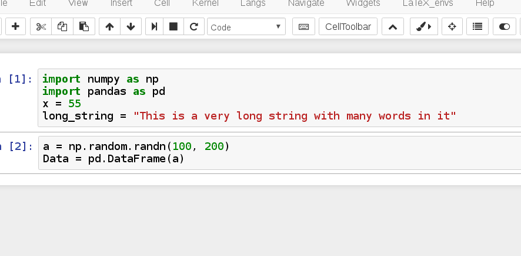

# Variable Inspector

## Description and main features

The Variable Inspector extension, which currently supports python and R kernels,  enables to collect all defined variables and display them in a floating window. The window not only display the name of variables but also  their type, size in memory and content. The columns are sortable. The window is draggable, resizable, collapsable. The list of displayed variables is automatically updated at each cell execution. Variables can be deleted from workspace by clicking a link. Position and state (displayed/collapsed) are stored in the notebook's metadata and restored at startup.

The extension supports multiple kernels. To add support for a new kernel, one has to
- provide a library which loads required modules and define a function which lists all variables, together with their name, type, size and content. The output of this function must be a JSON representation of a list of objects (one for each variable) with keys 'varName','varType', 'varSize', 'varContent',
- provide the command for deleting a variable, as `delete_cmd_prefix` and `delete_cmd_postfix`, eg. for `rm(variable)`, specify `rm(` and `)`.
- give the command to refresh the list of variables (usually this is a call to the function defined in the library above). This information can be provided either in the source file or in the yaml config file.

In any case, contributions to support further kernels will be very welcome!

#### Demo:

## Configuration
The initial configuration can be given using the IPython-contrib nbextensions facility. It includes:

- varInspector.window_display - Display at startup or not (default: false)
- varInspector.cols.lenName: (and .lenType, .lenVar) - Width of columns (actually the max number of character to display in each column)
- varInspector.kernels_config - json object defining the kernels specific code and commands.

## Notes
- The displayed size of variables use the `getsizeof()` python method. This method doesn't work for all types, so the reported size is to be considered with some caution. The extension includes some code to correctly return the size of numpy arrays, pandas Series and DataFrame but the size for some other types may be incorrect.
- The extension builds on some code provided [here](https://github.com/jupyter-widgets/ipywidgets/blob/master/docs/source/examples/Variable%20Inspector.ipynb)  (essentially the `_fill` method)
- The extension uses Christian Bach's [table sorter jquery plugin](https://github.com/christianbach/tablesorter). License file is included.

## History

- @jfbercher march 22, 2017 -- initial release
- @jfbercher april 03, 2017 -- multiple kernel support. added support for R kernels.
- @jfbercher june 30, 2017 -- fixed #1014 (use of `%reset` with IPython kernel) and #1015 printing with python 2 kernel.
