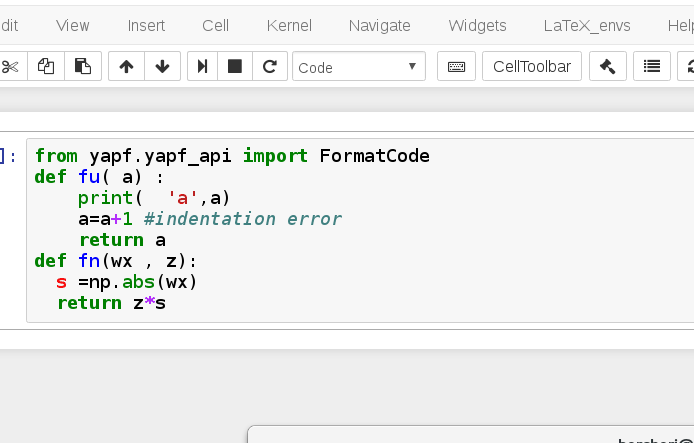

This extension uses the [YAPF](https://github.com/google/yapf) Python module to reformat IPython code cells. 
Of course, you must have `YAPF` package available somewhere in your Python path; 
Then the extension provides
- a toolbar button
- a keyboard shortcut (default: Ctrl-L)
for reformatting the current code-cell. 
Syntax shall be correct. The extension will point basic syntax errors, see demo. 



Of course, this extension is *not* language agnostic... However, this first attempt may be the basis for a more general "code prettyfier" extension.

Installation
------------

If you use [jupyter-contrib-nbextensions](https://github.com/ipython-contrib/jupyter_contrib_nbextensions), proceed as usual. 

Otherwise, you can still install/try the extension from my personal repo, using
```
jupyter nbextension install https://github.com/jfbercher/yapf_ext/archive/master.zip --user
jupyter nbextension enable yapf_ext-master/yapf_ext
```


History: 
---------
@jfbercher, august 14, 2016, first version. 